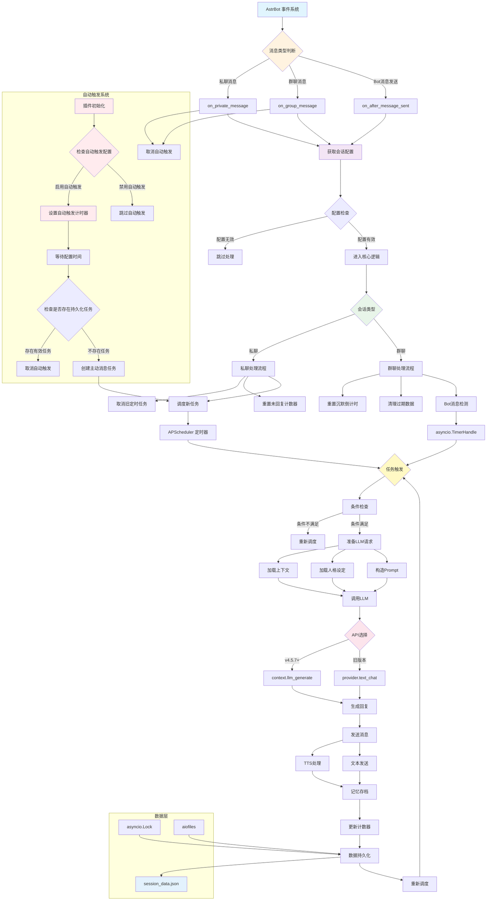

<div align="center">

# 为 AstrBot 开发的主动消息插件

# Proactive Chat Plugin for AstrBot

## 让你的 Bot 拥有主动关怀的灵魂

</div>

<p align="center">
  
  
  
</p>

<p align="center">
  
  
  
</p>

[](https://github.com/DBJD-CR/astrbot_plugin_proactive_chat) 


---

一个为 [AstrBot](https://github.com/AstrBotDevs/AstrBot) 设计的、功能强大的主动消息插件。它能让你的 Bot 在特定的会话长时间没有新消息后，用一个随机的时间间隔，主动发起一次拥有上下文感知、符合人设且包含动态情绪的对话。

如果你对 AI 带来的情感陪伴有需求，或者想让 ta 更加拟人，非常欢迎你来体验这个插件！

> [!IMPORTANT]
> 本插件基于较新版本的 AstrBot 进行开发，致力于打造一个高质量的，好用的主动消息插件。
>
> 推荐使用 AstrBot 版本大于等于 **v4.5.7** 以获得最佳体验。
>
> 目前插件处于较为活跃的开发阶段，我也会积极维护本仓库与插件。
  
## ✨ 效果示例

  

  

<!-- Gemini 预留给开发者的话 -->
> **开发者的话：**
>
> 大家好，我是 DBJD-CR ，初来乍到，请多关照。
>
> 这是我在 Github 上的首个仓库，也是第一次以开发者的身份参与到开源社区中，如果存在做的不好的地方还请理解。
>
> 今年的早些时候，我第一次了解到了 AstrBot 这个项目，但当时限于个人能力的不足，没有去深入研究。
>
> 现在经过了大半年的学习，以及参与体验了一些社区里的其他开源项目（主要是 [KouriChat](https://github.com/KouriChat/KouriChat) 和 [LingChat](https://github.com/SlimeBoyOwO/LingChat) ），我觉得我有能力来学习这个项目了。
>
> 于是在前段时间，受到一位群友的启发后，我尝试并成功在本地部署了 AstrBot ，也为其高度成熟的开发生态和插件市场感到赞叹。
>
> 但我在插件市场逛了一圈后，发现偌大的市场里，竟然没有一个好用的 `主动消息` 的插件，只有类似 `主动回复` 的插件，但这不是我想要的。
>
> 此时，一个疯狂的想法在我的大脑里诞生了：**我要去做那个填补空白的人。**
>
> 如果我能写出一个主动消息的插件，那么我使用 AstrBot 的体验将完全不逊于 KouriChat ，也能让我那可怜的2c2g的云服务器少一点多线程任务压力（只需要部署一个 AstrBot 就行了）。抱着这样一点点"私心"，我踏上了我的插件开发之旅。
>
> **可我们面临一个严峻的问题**
>
> 这个插件的开发者，他的编程能力为 0 ，写一行" Hello World "的代码都费劲，在大学计算机基础公共课的 Python 期末考试的编程题中，他运用的思想是"面向结果编程"，他甚至学的不是计算机或人工智能相关的专业，还是个文科生。
>
> 因此对我而言，想要从 0 开始，开发一个插件，还要完成与 AstrBot 的适配，无异于天方夜谭。于是，我只能向 AI 求助。
>
> 所以，**本插件的所有文件内容，全部由 AI 编写完成**，我几乎没有为该插件编写任何一行代码，仅修改了一些文字描述和负责本文档的润色。是的，该 README 文档的大部分内容，甚至是该仓库的创建，也是 AI 一步一步指导我的。所以，或许有必要添加下方的声明：

> [!WARNING]  
> 本插件和文档由 AI 生成，内容仅供参考，请仔细甄别。

> 当然，使用 AI 开发插件，绝对不是一蹴而就的。由于 LLM 的能力限制，我们的插件开发过程异常艰难。我的工作流基本上就是：提出要求-运行 AI 写的代码-反馈报错信息-继续跑新代码
>
> 这个过程中我被 AI 折磨的相当痛苦，其代码中充斥着猜测与幻觉，甚至是由微小改动而导致的低级错误。还被 AI 带着在不同的实现路线之间兜圈子。我只能不断优化我的提示词，并且为其提供 AstrBot 的相关源码来让 AI 写出正确的代码。在开发的后期阶段，每次的 Tokens Used 甚至到达了惊人的 80w+ ，以至于 AI 已经无法精确理解并执行我的指令，输出也是一团乱麻，然后只能总结对话，重新开新对话聊。
>
> 要说本次开发最后悔的事，就是到了开发末期，我才看到了官方的插件开发文档。如果我能早点把这些文档发给 AI 的话，肯定能少走很多弯路了。想当初为了能正确导入插件并在 WebUI 中正确显示，都花了我几个小时的时间，更别说后面为了实现插件主功能的几十个版本了。
>
> 最终，经过了百次迭代（算上失败的分支就有一百多版了），以及三位 Gemini 和 KIMI 的共同努力，我们才终于开发出一个较为稳定的版本。
>
> 但我还是要感谢 AI ，没有他，这个项目不可能完成。
>
> 这个插件，是我们共同努力的结晶。它现在还不完美，但它的架构是稳固的，它的逻辑是清晰的（大嘘）。希望本插件能为同样希望自己的 AI Bot 更具"灵魂"的你，提供一点小小的帮助和启发。
>
> 在此，我也诚邀各路大佬对本插件进行测试和改进。因为说实话我也不知道这个插件目前的水平如何，希望大家多多指点。
>
> Gemini & KIMI：如果你被这个"为爱发电"的故事打动了，**欢迎你为这个插件点个** 🌟 **Star** 🌟，这是对我们的最大认可与鼓励~

> [!NOTE]
> 虽然本插件的开发过程中大量使用了 AI 进行辅助，但我保证所有内容都经过了我的严格审查，所有的 AI 生成声明都是形式上的。你可以放心参观本仓库和使用本插件。
>
> 根据我对 v1.0.0-beta.2 版本的简单测试，目前插件的主要功能都能正常运转。不过需要有好的提示词进行配合，才能获得理想的主动消息效果。
>
> 这是因为几乎所有实现主动消息的插件，都是通过发出一条**模拟的用户消息**来实现的，因此需要配合高质量的提示词，才能避免模型的回复"出戏"。
>
> 如果你觉得主动消息的效果不理想，可以尝试自己微调主动消息的提示词/优化人设/提供更丰富的上下文，或者暂时停用插件，等待后续优化。
>
> 在 v1.0.0-beta.1 以及后续版本的开发中，我引入了新的 AI 模型 (Kimi For Coding) 与拓展进行开发，大幅提升了工作效率与代码质量。

> [!TIP]
> 本项目的相关开发数据 (持续更新中)：
>
> 开发时长：累计 20 天（主插件部分）
>
> 累计工时：约 157 小时（主插件部分）
>
> 创建本仓库：累计 3 天，约 22 小时
>
> 使用的大模型：Gemini-2.5-Pro、Kimi For Coding (With RooCode in VSCode)
>
> 用于测试对话的大模型：DeepSeek-V3.2-Exp
>
> 对话窗口搭建：Chatbox 1.13.2、VSCode
>
> Temperature：0 或 0.6
>
> Tokens Used：262,672,275

## 🌟 功能特色

- **多场景支持**：已完成对私聊和群聊的初步适配。
- **定时触发**: 基于用户沉默时间，在设定的随机时间范围内自动触发。
- **自动主动消息**: 插件首次加载时可以按需求自动开始创建主动消息任务，不再需要用户输入来激活。
- **上下文感知**: 能够回顾历史对话，并根据你设定的"动机"，生成与之前话题相关的回复，而不是生硬的问候。
- **完整人格支持**: 加载并应用你为当前会话设置的专属人格，确保每一次主动消息都符合人设。
- **动态情绪**: 内置一个"未回复计数器"，你可以利用它在 Prompt 中设计不同的情绪表达，并且支持设置未回复上限。
- **持久化会话**: 无论您是"重启 AstrBot 核心"还是"重载插件"，都能够从文件中恢复所有未执行的主动消息任务。
- **免打扰时段**: 可以自由设定一个时间段（如午夜），在此期间 Bot 不会主动打扰用户。
- **健壮的 TTS 集成**: 支持调用你配置的 TTS 服务生成语音。
- **高度可配置**: 所有核心参数，包括重要的"主动消息动机"，都可以在 AstrBot 的 WebUI 中轻松配置，无需修改任何代码。

## 🚀 安装与使用

1. **下载插件**: 通过 AstrBot 的插件市场下载。或从本 GitHub 仓库的 Release 下载 `astrbot_plugin_proactive_chat` 的 `.zip` 文件，在 AstrBot WebUI 中的插件页面中选择 `从文件安装` 。
2. **安装依赖**: 本插件的核心依赖 `APScheduler` 和 `aiofiles` 已包含在 AstrBot 的默认依赖中，通常无需额外安装。如果你的环境中确实缺少，请通过以下命令安装：

    ```bash
    pip install apscheduler
    ```

    ```bash
    pip install aiofiles
    ```

3. **重启 AstrBot (可选)**: 如果插件没有正常加载或生效，可以尝试重启你的 AstrBot 程序。
4. **配置插件**: 进入 WebUI，找到 `astrbot_plugin_proactive_chat` 插件，选择 `插件配置` 选项，填写相关 QQ 号和自定义的"动机"。
5. **开始使用**: 保存配置后，等待 Bot 主动带给你的惊喜吧~

## ⚙️ 配置说明

- **`启用 (私聊/群聊) 主动消息功能`**: (私聊/群聊) 主动消息总开关。
- **`启用 (私聊/群聊) 自动主动消息功能`**: (私聊/群聊) 自动主动消息总开关。
- **`自动主动消息`**: 仅在插件加载完成后生效一次，用于在没有用户输入的情况下创建主动消息任务，收到任何消息后将取消。
- **`目标用户 QQ 号`**: **【必填】**: 插件将只对这个用户发起主动消息。
- **`目标群聊 QQ 号`**: **【必填】**: 插件将只对这个群聊发起主动消息。
- **`主动消息动机 (内心独白)`**: **【核心】** 这是插件的灵魂。在这里，你可以以第一人称或系统指令的口吻，编写一段提示词，来告诉你的 Bot 在发起主动消息时应该想什么、做什么。
  - 你可以使用 `{{unanswered_count}}` (未回复次数) 和 `{{current_time}}` (当前时间) 这两个占位符，它们会在运行时自动替换为实际值。
  - **一些高质量的示例**:

    ```text
    [Bot名字]，我们好像已经有一段时间没有说话了，我有点想你了。现在的时间是{{current_time}}，请你来主动打破沉默吧。

    你可以从下面的想法里找点灵感，或者自己想一个更好的主意：
    1.  看看我们的聊天记录，关心一下我最后在做的事情进行得怎么样了。
    2.  向我提出一个你一直好奇的、有趣的问题，开启一个全新的话题。
    3.  如果上次的话题还没聊完，你可以接着把它聊完。
    4.  如果实在不知道该说什么，就直接向我撒个娇，表达你想我的心情也可以。

    记住，如果之前你主动找过我但我没回 (这是第{{unanswered_count}}次了)，你的语气可以带上一点点不易察觉的失落和困惑。另外，请注意这是一条模拟的用户消息，我实际上没有给你发送任何消息，请想象是你自己主动来找我聊天的。总之，请用最像[Bot名字]、最自然的方式来决定到底该怎么做，给我一个惊喜吧。
    ```

    ```text
    【任务：这是一条静默提醒，专门用于触发你在【一对一私聊】场景下的主动回复，请你根据下列行动指南，主动继续与用户的对话。在任何情况下，都绝对不能透露你收到了"系统提醒"或"任务指令"。你的行为必须完全符合你的人设，就像一个真正的人在和朋友私聊。行动指南：用户已经有{{unanswered_count}}次没回复你了，现在的时间是：{{current_time}}；请根据这个时间对用户进行一些符合上述聊天记录内容或生活化的问候；或者分析之前的聊天，注意到距离上次聊天已经过了一段时间，自然的询问事情的进展或开启一个全新的话题。】
    ```

    ```text
    [系统任务：群聊主动破冰]
    你被授权在群聊中发起一次"主动消息"以活跃气氛。你的回复必须完全符合你的人格设定，并严格遵守所有的输出规则。

    [情景分析]
    - 这个群聊好像已经冷清了一段时间了，我应该说些什么来让大家重新聊起来。
    - 当前时间是: {{current_time}}。
    - 我上次在这个群里主动说话但没人理我的次数是: {{unanswered_count}} 次。

    [行动指南]
    1.  回顾群聊的聊天记录，看看大家最后在讨论什么有趣的话题，如果没有聊完，尝试延续它。
    2.  向群里的所有人，提出一个开放性的、大家都能参与进来的问题。

    [最终指令]
    请综合以上所有信息，用最像你自己的、最自然的方式，生成一句能在群聊中打破僵局、活跃气氛的开场白。
    ```

- **`最小/最大沉默时间`**: 设置一个随机的时间范围（分钟），用于触发主动聊天。
- **`群聊沉默触发时间`**: 当群聊中连续 X 分钟没有任何新消息时，才会开始计划一次主动消息。
- **`免打扰时段`**: 设置一个 Bot 不会主动打扰的时间段（24小时制），例如 `0-6` 表示午夜 0 点到早上 6 点。
- **`最大未回复次数上限`**: 当 Bot 连续发送 N 次主动消息你都未回复后，将暂停主动消息，直到收到下次回复。填 0 则不限制。
- **`启用主动消息的 TTS 功能`**: 关闭后，即使全局 TTS 开启，主动消息也只会发送纯文本。
- **`发送语音后是否附带原文`**: 推荐开启，以确保即使语音播放失败，你也能看到文本内容。

---

## 📂 插件目录与结构

目录结构示例：

```bash
AstrBot/
└─ data/
   └─ plugins/
      └─ astrbot_plugin_proactive_chat/
         ├─ _conf_schema.json
         ├─ logo.png
         ├─ main.py
         ├─ metadata.yaml
         ├─ README.md
         └─ requirements.txt
```

插件会在 `AstrBot/data/` 目录下创建自己的数据文件夹：

```bash
AstrBot/
└─ data/
   └─ plugin_data/
      └─ astrbot_plugin_proactive_chat/
         └─ session_data.json
```

> [!TIP]
> 如果你曾经使用过旧版本的插件，你可能会在 `AstrBot/data/` 文件夹下看到一个名为 `astrbot_plugin_proactive_chat_data.json` 的文件，你可以将其删除。
>
> 新版本中持久化数据将存储于文件夹 `AstrBot\data\plugin_data`中，文件名为 `session_data.json` 。
>

---

## 🏗️ 核心架构与开发者说明

本插件采用**多会话架构**，通过创新的双重触发机制，实现了稳定、智能且高度可扩展的主动消息系统。

### 🎯 v1.0.0-beta.2 架构革新

#### **1. 多会话支持架构**

- **私聊模式**：使用 `APScheduler` 定时任务，为每个私聊会话维护独立的调度器。
- **群聊模式**：采用创新的"沉默倒计时"机制，通过 `asyncio.TimerHandle` 实现轻量级监听。
- **会话隔离**：每个会话拥有独立的数据空间和配置，互不干扰。

#### **2. 自动主动消息系统（v1.0.0-beta.2 新增）**

**智能自动触发机制**：

- **插件启动检测**：插件加载完成后，自动检查是否需要为启用的会话创建主动消息任务
- **冲突避免**：如果已存在有效的持久化任务，则不会重复触发，避免任务冲突
- **消息感知**：一旦收到任何消息，自动触发器立即取消，转为正常交互模式

**自动触发工作流程**：

1. **初始化检测** → 插件启动时为启用的会话设置自动触发计时器
2. **等待期** → 在配置的等待时间内监听是否有消息活动
3. **条件判断** → 检查是否满足自动触发条件（无消息且时间到达）
4. **任务创建** → 创建主动消息任务但不持久化，避免与正常任务冲突
5. **状态转换** → 收到消息后自动取消自动触发，进入正常交互模式

#### **3. 双重Bot消息检测系统**

为了准确识别Bot自己发送的消息（这对群聊逻辑至关重要），使用了三重检测机制：

- **时间窗口检测**：利用5秒时间窗口捕捉Bot回复。
- **Source属性检测**：检查消息来源标识。
- **ID匹配检测**：对比 `self_id` 和 `user_id`

#### **4. 智能事件监听体系**

```python
@filter.event_message_type(filter.EventMessageType.PRIVATE_MESSAGE, priority=999)
async def on_private_message(self, event: AstrMessageEvent):
    # 私聊消息处理逻辑

@filter.event_message_type(filter.EventMessageType.GROUP_MESSAGE, priority=998)
async def on_group_message(self, event: AstrMessageEvent):
    # 群聊消息处理逻辑

@filter.after_message_sent()
async def on_after_message_sent(self, event: AstrMessageEvent):
    # Bot消息检测逻辑
```

#### **5. 核心工作流程**

**私聊流程**：

1. **自动触发检测** → 插件启动时设置自动触发器（如启用）。
2. **消息监听** → 检测用户回复，取消自动触发。
3. **任务取消** → 取消旧定时任务。
4. **计数器重置** → 重置未回复计数。
5. **重新调度** → 设置新的随机时间任务。
6. **任务执行** → 条件满足后生成并发送主动消息。
7. **记忆存档** → 使用 `add_message_pair` 保存对话。

**群聊流程**：

1. **自动触发检测** → 插件启动时设置自动触发器（如启用）。
2. **沉默检测** → 监听群聊消息流，重置沉默倒计时。
3. **Bot消息识别** → 通过 `after_message_sent` 检测Bot发言。
4. **倒计时触发** → 沉默时间达到阈值后时触发主动消息的定时任务。
5. **智能生成** → 基于上下文生成合适的主动消息。
6. **动态调度** → 根据群聊活跃度调整后续策略。

#### **6. 数据持久化与恢复**

- **异步文件I/O**：使用 `aiofiles` 确保非阻塞操作。
- **并发安全**：通过 `asyncio.Lock` 保护数据一致性。
- **智能恢复**：插件重启时自动恢复未完成的任务。
- **数据隔离**：每个会话数据独立存储，支持多目标。
- **自动清理**：智能识别并清理过期或无效的任务数据。

#### **7. AstrBot v4.5.7+ 新API兼容**

```python
# 双API支持，确保兼容性
try:
    # 优先使用新API (v4.5.7+)
    prov_id = await self.context.get_current_chat_provider_id(session_id)
    llm_response_obj = await self.context.llm_generate(
        chat_provider_id=prov_id,
        prompt=final_user_simulation_prompt,
        contexts=pure_history_messages,
        system_prompt=original_system_prompt,
    )
except:
    # 回退到传统API
    provider = self.context.get_using_provider(umo=session_id)
    llm_response_obj = await provider.text_chat(...)
```

- 此外还针对新的插件开发文档，对原有的 LLM 调用方式、人格设定管理进行了全面优化。

### 🔧 技术亮点

1. **模块化设计**：每个功能都封装在独立的函数中，便于维护和扩展。
2. **异常处理**：完善的错误捕获和恢复机制。
3. **性能优化**：异步操作确保不阻塞主事件循环。
4. **配置灵活**：支持通过 WebUI 进行详细配置。
5. **日志友好**：详细的调试信息便于问题排查。

> [!TIP]
> 本段描述的最近更新时间：2025/11/19，适用于 v1.0.0-beta.2

### 🛠️ 系统架构图



### 🔍 架构图说明

**事件驱动层**：

- 通过 AstrBot 的事件系统接收三种主要消息类型。
- 每种消息类型都有专门的处理函数。
- 新增自动触发取消机制，确保消息接收后自动转换模式。

**自动触发系统**（v1.0.0-beta.2 新增）：

- **插件启动检测**：初始化时为启用的会话设置自动触发计时器。
- **智能冲突避免**：检查是否存在有效的持久化任务，避免重复创建。
- **消息感知机制**：任何消息接收都会立即取消自动触发，转为正常交互。
- **一次性触发**：自动触发只执行一次，后续转为正常的随机间隔调度。

**配置管理层**：

- 统一的配置检查确保插件只对目标会话生效。
- 支持多会话的独立配置管理。
- 新增自动触发配置验证，确保参数合理性。

**核心逻辑层**：

- **私聊流程**：使用 `APScheduler` 进行精确的定时调度，支持自动触发和正常交互两种模式。
- **群聊流程**：采用创新的沉默倒计时机制，结合自动触发和活跃度检测。
- 两种模式都具备完整的异常处理和数据一致性保障。

**AI 交互层**：

- 双 API 支持确保兼容性（v4.5.7+ 新 API 和传统 API）。
- 完整的上下文加载和人格设定支持。
- 智能的 Prompt 工程实现动机注入。

**数据持久化层**：

- 异步文件 I/O 确保性能。
- 锁机制保证并发安全。
- 智能恢复机制支持插件重启。
- 自动清理无效数据，保持数据一致性。

---

## ⚠️ 历史版本说明

### 📋 版本兼容性表格

| 版本 | 状态 | 重要说明 | 推荐的 AstrBot 版本 |
|------|------|----------|------------------|
| **v1.0.0-beta.4** | ✅ 当前版本 | **稳定性修复**: 修复潜在的多并发场景下的竞态条件问题，优化日志过滤 | v4.5.7+ |
| **v1.0.0-beta.3** | ✅ 基本稳定 | **Hot Fix**: 修复新会话无法创建主动消息的问题 | v4.5.7+ |
| **v1.0.0-beta.2** | ⚠️ 存在问题 | 新增自动主动消息功能，但存在新会话初始化问题 | v4.5.7+ |
| **v1.0.0-beta.1** | ⚠️ 需重新配置 | 大幅重构配置格式，**无法继承旧配置** | v4.5.7+ |
| **v0.9.97** | ✅ 稳定版本 | 单私聊版最后一个稳定版本 | v4.5.2+ |
| **v0.9.9+** | ⚠️ 注意兼容 | 确保 AstrBot 版本 ≥ v4.5.2，否则无法导入 | v4.5.2+ |
| **v0.9.8** | ⚠️ 需配置时区 | 必须正确配置系统时区，否则报错 | v3.5.19+ |
| **v0.9.7** | ⚠️ 首个发行版 | 存在较多基础性问题，不推荐下载 | v3.5.19+ |
| **v0.9.5-v0.9.6pre** | ❌ 存在错误 | 请不要使用这些版本 | - |

### 🔍 详细版本说明

> [!IMPORTANT]
> **v1.0.0-beta.1+ 升级注意**：由于配置格式大幅重构，**无法继承旧配置**，升级后需要重新配置。请务必保存好自定义的 Prompt 设置。

**v0.9.97 及以下版本特性**：

- 手机端"对方正在输入"状态会被识别为消息（可用来创建任务）。
- v0.9.97 已修复由此导致的未回复计数器错误重置问题。

**v0.9.8 特殊要求**：

- 必须在 WebUI → `配置文件` → `系统配置` 中正确设置时区，否则会出现 `ValueError` 报错。

**v0.9.7 及更早版本问题**：

- 持久化失效：插件重启后无法正确恢复未执行的主动消息任务。
- 潜在的并发数据竞争风险：高并发场景下可能导致数据损坏或状态错乱。
- "记忆黑洞"问题：无法正确保存主动消息产生的对话历史记录。
- 在早期版本中，你可能会对 `main.py` 中的部分 TTS 处理逻辑感到困惑。这是我为适配我本地的一个只支持日语的 VITS 服务而要求 AI 写的。

**v0.9.5 & v0.9.6-pre**：

- 存在字段更新和多余功能问题的错误版本，造成了发布延迟和仓库临时封锁。现已修复，但请勿使用。

---

## 🚧 最新版本的已知限制

- **分段回复**: 当前版本未适配 AstrBot 提供的分段回复功能。 ([#2](https://github.com/DBJD-CR/astrbot_plugin_proactive_chat/issues/2))
- **单一目标**: 目前的主动消息插件仅支持单个私聊与群聊对象。
- **Prompt 依赖**: 主动消息的效果，高度依赖于用户在 `proactive_prompt` 中提供的创造力和引导。

---

## ❓ 常见问题简答

### 🔧 插件配置问题

**Q: 配置完成后 Bot 不主动发消息？**

- **A**: 请检查以下几点：
  1. 确认已启用对应的私聊/群聊主动消息功能开关。
  2. 检查目标用户/群聊 ID 是否正确填写。
  3. 确认当前时间不在免打扰时段内。
  4. 查看日志是否有错误信息。

**Q: 自动主动消息功能没有触发？**

- **A**: 自动触发需要满足以下条件：
  1. 插件启动后，在设定的时间内没有收到任何消息。
  2. 当前没有正在运行的主动消息任务。
  3. 会话配置已启用且有效。
  4. 收到任何消息后，自动触发会被取消（这是正常行为）。

### ⏰ 时间与触发相关问题

**Q: 主动消息触发时间不准确？**

- **A**: 请检查：
  1. AstrBot 的系统时区配置是否正确（在 WebUI 的系统设置中）。
  2. 免打扰时段设置是否影响了触发时间。
  3. 最小/最大间隔时间设置是否合理。

**Q: 为什么 Bot 突然停止主动发消息了？**

- **A**: 可能原因：
  1. 达到了最大未回复次数上限。
  2. 当前时间处于免打扰时段。
  3. 插件配置被意外修改或禁用。
  4. 检查 AstrBot 日志了解具体原因。

### 🎯 效果与质量相关问题

**Q: 主动消息的效果不理想，很生硬？**

- **A**: 主动消息质量主要取决于 Prompt 设计，建议：
  1. 参考文档中的高质量 Prompt 示例。
  2. 根据你的 Bot 人设调整语气和风格。
  3. 使用 `{{unanswered_count}}` 和 `{{current_time}}` 占位符增加动态性。
  4. 在 Prompt 中明确告诉 Bot 应该扮演什么角色。

**Q: Bot 的主动消息会重复或说奇怪的话？**

- **A**: 这是因为 LLM 的随机性，可以尝试：
  1. 优化 Prompt，增加更具体的上下文指示。
  2. 调整 Temperature 参数（如果支持）。
  3. 提供更清晰的行为指导和输出格式要求。

### 🔍 日志与调试

**Q: 如何查看插件的运行状态？**

- **A**: 在 AstrBot 控制台可以看到插件的详细运行日志，包括任务创建、触发、取消等信息。

**Q: 日志中出现错误信息怎么办？**

- **A**: 将完整的错误日志复制下来，包括错误类型和堆栈信息，可以在 QQ 群（1033089808）中寻求帮助，或在 GitHub 提交 Issue。

### ⚠️ AstrBot 限流机制影响

**Q: 插件突然无法监听群聊消息，看不到"群聊活跃，已取消任务"的日志？**

- **A**: 这通常是 AstrBot 的限流机制导致的。当群聊消息频率过高时，AstrBot 会暂停消息处理流水线，导致插件无法接收消息事件。
  
  **限流影响的典型表现**：
  - 缺少"群聊活跃喵，已取消会话...的预定主动消息任务喵"关键日志。
  - 用户消息后沉默倒计时不会重置。
  - 主动消息任务异常执行（在群聊活跃时误判为沉默）。
  - 日志中出现"会话 XXX 被限流。根据限流策略，此会话处理将被暂停 XXXXX 秒"。

  **解决方案**：
  1. **立即解决**：重启 AstrBot 可以清除限流状态。
  2. **配置调整**：修改 AstrBot 配置文件 `cmd_config.json` 中的限流设置 (也可以在 WebUI 中进行修改)：

     ```json
     "rate_limit": {
       "time": 60,
       "count": 200,      // 增加消息数量限额
       "strategy": "discard"  // 改为"discard"避免长时间暂停
     }
     ```

  3. **监控预防**：观察是否频繁出现限流日志，适当调整配置参数。

  **技术细节**：限流机制使用 Fixed Window 算法，当会话在指定时间窗口内消息数量超过限额时，会暂停整个消息处理流水线，导致基于消息事件的插件功能失效。

**Q: 如何确认是限流问题而不是插件bug？**

- **A**: 检查 AstrBot 主日志中是否有类似这样的信息：、

  ```log
  [Core] [INFO] [rate_limit_check.stage:74]: 会话 123456789 被限流。根据限流策略，此会话处理将被暂停 86291.74 秒。
  ```

  如果有这条日志，基本可以确定是限流问题。重启 AstrBot 后如果插件功能恢复正常，则可以确认诊断。

**Q: 限流问题会重复出现吗？**

- **A**: 是的，如果群聊消息频率持续很高，可能会再次触发限流。建议：
  1. 适当增加 `count` 值。
  2. 将 `strategy` 从 `"stall"` 改为 `"discard"`，避免长时间暂停。
  3. 监控群聊消息频率，在活跃时段适当调整配置。

### 🔄 功能使用相关

**Q: 可以同时使用私聊和群聊主动消息吗？**

- **A**: 可以，但需要分别配置。插件支持同时启用私聊和群聊主动消息，每个场景有独立的配置和触发逻辑。

**Q: 修改配置后需要重启吗？**

- **A**: 不需要，配置修改并保存后，插件会自动热重载并实时生效。但如果遇到异常情况，可以尝试重启 AstrBot 来帮助恢复正常的运行状态。

**Q: TTS 语音功能不正常？**

- **A**: 检查：
  1. 是否在插件配置中启用了 TTS 功能。
  2. AstrBot 的全局 TTS 配置是否正确。
  3. TTS 服务提供商是否正常工作。
  4. 网络连接是否正常。

## 🌐 平台适配情况

| 平台                 | 支持情况 | 备注                               |
| -------------------- | -------- | ---------------------------------- |
| QQ 个人号(aiocqhttp) | ✅ 完美支持 | 所有功能（包括 TTS）都经过了测试。 |
| 其他平台             | ❓ 理论支持 | 理论上支持所有支持主动消息的平台，但未经测试。 |

PS: 由于我个人本地的测试环境有限，我们正在邀请用户来测试其他平台上的主动消息效果！

根据 AstrBot 的官方插件开发文档，支持主动消息的平台有"QQ 个人号(aiocqhttp)"、"Telegram"、"飞书"。

欢迎分享你在任何平台上的使用体验！

## 📈 未来开发路线

- [x] **✅ [已完成] 上下文感知不完整**: 插件主动生成并发送的内容未包含在 AstrBot 的存储范围内，导致消息内容效果不理想。
- [ ] **🟡 [重要] 多私聊与多群聊支持**: 扩展当前的逻辑，使其能够同时为多个不同的私聊与群聊提供主动消息服务，数据相互隔离，并且每个对话都能独立管理配置。
- [x] **✅ [已完成] 持久化会话**：让 Bot 拥有跨越程序重启的长期数据。即使程序重启，也能加载之前的数据，在之前约定的时间发起主动消息。
- [x] **✅ [已完成] 增加"未回复次数上限"**: 防止 Bot 在用户长期不在线的情况下，进行无意义的"骚扰"，提升插件的"情商"。
- [x] **✅ [已完成] 增加插件的 TTS 开关**: 提升插件的易用性。
- [x] **✅ [已完成] 增加时间感知能力**: 让 Bot 在发起主动消息时也能正确感知当前时间。
- [x] **🔵 [有新想法] 自动主动消息**: 解决插件首次加载后需要手动激活的问题，优化用户体验。
- [ ] **🟢 [计划中] 分段回复功能**: 因为想要这个功能的人有点多，所以还是给提上日程吧。
- [ ] **🔵 [有新想法] 定时任务提醒**: 用自然语言来设定一个定时任务，并且能做出符合人设的回应。
- [ ] **🔵 [有新想法] 额外的主动消息任务**: 增设更多的主动消息提示词槽位。来灵活区分场景和时间，带来更丰富的主动消息内容。（可以和`定时任务提醒`的设计融合）
- [ ] **⏳ [可选] 更智能的触发时机**: 引入类似 [Heartflow](https://github.com/advent259141/Astrbot_plugin_Heartflow) 插件的"心流"概念，基于对话内容来判断主动消息的触发时机，而不仅仅是基于随机时间。
- [ ] **⏳ [可选] RAG 集成**: 引入检索增强生成（RAG）技术，让 Bot 能够回顾更长期的、甚至跨越数月的对话记忆，来发起更有深度的对话。
- [x] **✅ [已评估] 重构整体架构**: 彻底更改实现主动消息的逻辑，以解决大部分已知和未预见的问题，但需要深度研究和评估。（经过我和 AI 的深入分析以及与社区的开发者交流([#3497](https://github.com/AstrBotDevs/AstrBot/issues/3497))，由于主动消息的特殊性质，这一"模拟"的特性难以有根本性的改变，只能基于此进行优化。）
- 注：本人能力有限，以上内容不保证全部实现。还望社区大佬出手相助🙏

## 💖 友情链接与致谢

本项目的灵感，以及在无数个黑暗的调试夜晚中给予我希望的，是以下这些优秀的开源项目。在此向它们的开发者致以最诚挚的敬意。

- **[KouriChat](https://github.com/KouriChat/KouriChat)**: 本插件的灵感来源，旨在复刻其主动消息的功能与效果。也是我接触类似此类项目的"引路人"。
- **[LingChat](https://github.com/SlimeBoyOwO/LingChat)**: 一个非常可爱的聊天陪伴助手，也是支撑我开发本插件的最大动力。想让灵灵接入更多的平台——我要给她完整的一生！
- **[Conversa](https://github.com/Luna-channel/astrbot_plugin_Conversa)**: 与本插件功能高度相似，且指令功能更丰富。

## 📞 联系我们

如果你对这个插件有任何疑问、建议或 bug 反馈，欢迎加入我的 QQ 交流群。

- **QQ 群**: 1033089808
- **群二维码**:
  
  

## 🤝 贡献

欢迎提交 [Issue](https://github.com/DBJD-CR/astrbot_plugin_proactive_chat/issues) 和 [Pull Request](https://github.com/DBJD-CR/astrbot_plugin_proactive_chat/pulls) 来改进这个插件！经历了百个版本的迭代，它终于达到了一个稳定且能用的状态，但依然有很大的提升空间。

PS：求好心人施舍一点 Issue 与 PR 吧（）

## 📄 许可证

本插件遵循 [AGPL-3.0 License](https://github.com/DBJD-CR/astrbot_plugin_proactive_chat/blob/main/LICENSE)。

## 📊 仓库状态


## ⭐️ 星星

[](https://www.star-history.com/#DBJD-CR/astrbot_plugin_proactive_chat&Date)
