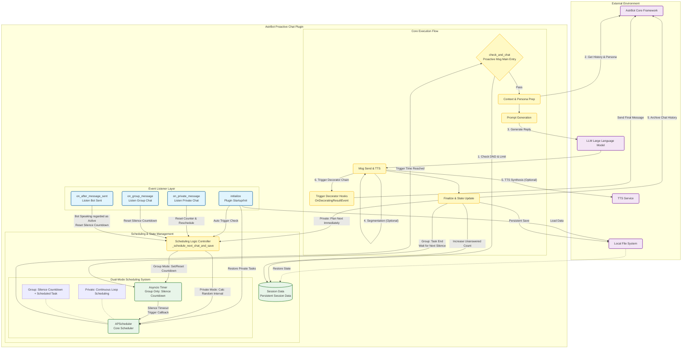

<!-- markdownlint-disable MD033 -->
<div align="center">

# Proactive Chat Plugin for AstrBot

## Give Your Bot a Caring Soul

[简体中文](README.md) | English | [日本語](README_JP.md)

</div>

<p align="center">
  
  
  
</p>

<p align="center">
  
  
  
</p>

<p align="center">
  <a href="https://deepwiki.com/DBJD-CR/astrbot_plugin_proactive_chat" target="_blank"></a>
  <a href="https://zread.ai/DBJD-CR/astrbot_plugin_proactive_chat" target="_blank"></a>
</p>

[](https://github.com/DBJD-CR/astrbot_plugin_proactive_chat)


---

  A powerful proactive messaging plugin designed for [AstrBot](https://github.com/AstrBotDevs/AstrBot). It allows your Bot to proactively initiate a context-aware, character-consistent conversation with dynamic emotions at random intervals after a long period of silence in specific sessions.

  If you need the emotional companionship brought by AI, or want to make it more anthropomorphic, you are very welcome to try this plugin!

> [!IMPORTANT]
> This plugin is developed based on a newer version of AstrBot, dedicated to creating a high-quality, easy-to-use proactive messaging plugin.
>
> In general, it is recommended to use the latest AstrBot version for the best experience.
>
> Currently, the plugin is in a relatively stable development stage, and I will continue to maintain this repository and the plugin.

## 📑 Quick Navigation

> **💡 Hint**: Click the links below to quickly jump to the corresponding section

- [✨ Demo](#-demo)
- [🌟 Features](#-features)
- [🚀 Installation and Usage](#-installation-and-usage)
- [⚙️ Configuration](#config)
- [📂 Plugin Directory and Structure](#-plugin-directory-and-structure)
- [🏗️ Core Architecture and Developer Notes](#core)
- [⚠️ Version History](#ver)
- [🚧 Known Limitations](#-known-limitations)
- [❓ FAQ](#-faq)
- [🌐 Platform Compatibility](#-platform-compatibility)
- [📈 Roadmap](#-roadmap)
- [💖 Links and Acknowledgements](#-links-and-acknowledgements)

---
  
## ✨ Demo

  

  

<!-- Words reserved for developers by Gemini -->
> **Developer's Note:**
>
> Hello everyone, I am DBJD-CR. I am new here, please take care of me.
>
> This is my first repository on GitHub, and it is also the first time I participate in the open source community as a developer. Please understand if there are any shortcomings.
>
> Earlier this year, I learned about the AstrBot project for the first time, but due to my lack of personal ability at that time, I did not study it in depth.
>
> Now, after more than half a year of learning and experiencing some other open source projects in the community (mainly [KouriChat](https://github.com/KouriChat/KouriChat) and [LingChat](https://github.com/SlimeBoyOwO/LingChat)), I feel that I have the ability to learn this project.
>
> So a while ago, inspired by a group friend, I tried and successfully deployed AstrBot locally, and I was amazed by its highly mature development ecosystem and plugin market.
>
> But after browsing the plugin market, I found that there was no easy-to-use `proactive messaging` plugin in such a large market, only plugins similar to `active reply`, but this is not what I wanted.
>
> At this time, a crazy idea was born in my brain: **I want to be the one to fill the gap.**
>
> If I can write a proactive messaging plugin, then my experience of using AstrBot will be no less than KouriChat, and it will also reduce the multi-threaded task pressure on my poor 2c2g cloud server (only need to deploy one AstrBot). With such a little "selfishness", I embarked on my plugin development journey.
>
> **But we face a serious problem**
>
> The developer of this plugin has a programming ability of 0. It is struggling to write a line of "Hello World" code. In the Python final exam programming question of the university computer basic public course, the thought he used was "result-oriented programming". He didn't even study computer or artificial intelligence related majors, but was a liberal arts student.
>
> Therefore, for me, wanting to develop a plugin from scratch and complete the adaptation with AstrBot is tantamount to a fantasy. So, I can only turn to AI for help.
>
> So, **all file contents of this plugin are completely written by AI**. I wrote almost no code for this plugin, only modified some text descriptions and was responsible for polishing this document. Yes, most of the content of this README document, and even the creation of this repository, were guided by AI step by step. So, it may be necessary to add the following statement:

> [!WARNING]  
> This plugin and documentation are generated by AI, the content is for reference only, please distinguish carefully.

> Of course, using AI to develop plugins is definitely not accomplished overnight. Due to the limitations of LLM capabilities, our plugin development process was extremely difficult. My workflow is basically: Make a request - Run AI-written code - Feedback error information - Continue to run new code.
>
> During this process, I was tortured by AI quite painfully. Its code was full of guesses and hallucinations, and even low-level errors caused by minor changes. I was also led by AI to circle between different implementation routes. I could only constantly optimize my prompts and provide it with AstrBot's relevant source code to let AI write the correct code. In the later stage of development, the Tokens Used each time even reached an astonishing 80w+, so that the AI could no longer accurately understand and execute my instructions, and the output was a mess, and then I could only summarize the conversation and restart a new conversation.
>
> Speaking of the most regretful thing about this development, it was that I only saw the official plugin development documentation at the end of the development. If I could send these documents to AI earlier, I would definitely have taken a lot fewer detours. Thinking back to the beginning, it took me several hours just to import the plugin correctly and display it correctly in the WebUI, let alone the dozens of versions later to implement the main function of the plugin.
>
> Finally, after hundreds of iterations and the joint efforts of three Gemini and KIMI, we finally developed a stable version.
>
> But I still want to thank AI. Without him, this project could not have been completed.
>
> This plugin is the crystallization of our joint efforts. It is not perfect now, but its architecture is solid and its logic is clear (Just kidding). I hope this plugin can provide a little help and inspiration for you who also want your AI Bot to have more "soul".
>
> Here, I also sincerely invite all bigwigs to test and improve this plugin, and I hope everyone will give more advice.
>
> Gemini & KIMI: If you are moved by this story of "generating electricity for love", **you are welcome to give this plugin a** 🌟 **Star** 🌟, this is the greatest recognition and encouragement for us~

> [!NOTE]
> Although AI was heavily used to assist in the development of this plugin, I guarantee that all content has been strictly reviewed by me, and all AI generation statements are formal. You can visit this repository and use this plugin with confidence.
>
> Currently, the main functions of the plugin can work normally. However, good prompt words are needed to cooperate to obtain the ideal proactive message effect.
>
> This is because almost all plugins that implement proactive messages are implemented by sending a **simulated user message**, so high-quality prompt words are needed to avoid the model's reply being "out of character".
>
> If you feel that the effect of the proactive message is not ideal, you can try to fine-tune the prompt words of the proactive message/optimize the persona/change to a better capable model/provide richer context yourself.
>
> In the development of v1.0.0-beta.1 and subsequent versions, I introduced new AI models and workflows for development, greatly improving work efficiency and code quality. (Looking back now, the way I wrote plugins at the beginning was like a primitive person 😂)

> [!TIP]
> Relevant development data of this project (continuously updated):
>
> Development duration: accumulated 34 days (main plugin part)
>
> Cumulative man-hours: about 206 hours (main plugin part)
>
> Creating this repository: accumulated 3 days, about 22 hours
>
> Large models used: Gemini-2.5-Pro, Kimi For Coding, Gemini-3.0 Pro (With RooCode in VSCode)
>
> Large models used for testing conversations: DeepSeek-V3.2-Exp, DeepSeek-V3.2
>
> Plugin Logo drawing: Doubao-Seedream-3.0-t2i
>
> Chat window construction: Chatbox 1.13.2, VSCode
>
> Temperature: 0 or 0.6
>
> Tokens Used: 407,196,733

## 🌟 Features

- **Multi-Session Support**: Supports providing proactive message services for multiple private chats and group chats at the same time, and each session is managed completely independently. Provides 5 additional private chat + 5 group chat personalized configuration slots, where you can set exclusive configurations and remark names.
- **Global Configuration System**: Manage more sessions through `session_list`, using global configuration as a fallback.
- **Session Complete Isolation**: Each session has independent states, counters, and triggers to avoid mutual interference.
- **Timed Trigger**: Automatically triggers within a set random time range based on user silence time.
- **Automatic Proactive Message**: When the plugin is loaded for the first time, it can automatically start creating proactive message tasks according to requirements, without user input to activate.
- **Context Awareness**: Can review historical conversations and generate replies relevant to previous topics based on the prompts you set, rather than stiff greetings.
- **Full Persona Support**: Loads and applies the exclusive persona you set for the current session, ensuring that every proactive message conforms to the character setting.
- **Dynamic Emotion**: Built-in "unanswered counter", you can use it to design different emotional expressions in the Prompt, and support setting an unanswered upper limit.
- **Persistent Session**: Whether you "restart AstrBot" or "reload the plugin", all unexecuted proactive message tasks can be recovered from the file.
- **Do Not Disturb Period**: You can freely set a time period during which the Bot will not proactively disturb the user.
- **TTS Integration**: Supports calling the TTS service you configured to generate voice.
- **Segmented Reply**: Supports splitting long text replies into multiple short messages and simulating real typing intervals to make the conversation more natural.
- **High Compatibility**: Compatible with other plugins that need to modify proactive messages, such as meme plugins, emotion simulation plugins, etc.
- **Highly Configurable**: All core parameters can be easily configured in AstrBot's WebUI for quick start. No need to modify any code, and no need to learn and memorize any plugin commands.

## 🚀 Installation and Usage

1. **Download Plugin**: Download via AstrBot's plugin market. Or download the `.zip` file of `astrbot_plugin_proactive_chat` from the Release of this GitHub repository, and select `Install from file` on the plugin page in AstrBot WebUI.
2. **Install Dependencies**: The core dependencies of this plugin `APScheduler` and `aiofiles` are already included in AstrBot's default dependencies, and usually do not need to be installed separately. If your environment is indeed missing them, please install them via the following commands:

    ```bash
    pip install apscheduler
    ```

    ```bash
    pip install aiofiles
    ```

3. **Restart AstrBot (Optional)**: If the plugin does not load or take effect properly, try restarting your AstrBot program.
4. **Configure Plugin**: Enter WebUI, find the `astrbot_plugin_proactive_chat` plugin, select the `Plugin Configuration` option, and fill in the relevant QQ number and custom "motivation".
5. **Start Using**: After saving the configuration, wait for the surprise your Bot proactively brings you~

## <a id="config"></a>⚙️ Configuration

- **`Enable (Private/Group) Proactive Message`**: Master switch for (private/group) proactive messages.
- **`Enable (Private/Group) Auto Proactive Message`**: Master switch for (private/group) automatic proactive messages.
- **`Enable Auto Proactive Message (Private/Group)`**: Only takes effect once after the plugin is loaded. It is used to create proactive message tasks without user input, and will be cancelled after receiving any message.
- **`Target User QQ`**: The plugin will only initiate proactive messages to this user.
- **`Target Group QQ`**: The plugin will only initiate proactive messages to this group.
- **`Proactive Message Motivation (Inner Monologue)`**: **【Core】** This is the soul of the plugin. Here, you can write a prompt in the first person or system instruction tone to tell your Bot what to think and do when initiating a proactive message.
  - You can use two placeholders `{{unanswered_count}}` (unanswered count) and `{{current_time}}` (current time), which will be automatically replaced with actual values at runtime.
  - Note to explicitly remind your Bot that this is a proactive message, otherwise it is easy to be mistaken for you proactively coming to talk to him, resulting in an "out of character" reply. (Due to the randomness of LLM, even if explicitly informed, there is still a small probability of this happening, but clear prompts can alleviate this situation)
  - **Some high-quality examples**:

    ```text
    [Bot Name], we seem to haven't spoken for a while, I miss you a bit. The time now is {{current_time}}, please take the initiative to break the silence.

    You can look for inspiration from the ideas below, or come up with a better idea yourself:
    1. Look at our chat history and care about how the things I was working on are going.
    2. Ask me an interesting question you have always been curious about to start a brand new topic.
    3. If the last topic hasn't been finished, you can continue to finish it.
    4. If you really don't know what to say, just act like a spoiled child to me and express your missing for me.

    Remember, if you proactively looked for me before but I didn't reply (this is the {{unanswered_count}}th time), your tone can carry a little bit of imperceptible loss and confusion. In addition, please note that this is a simulated user message. I actually did not send you any messages. Please imagine that you are proactively coming to chat with me. In short, please decide what to do in the most natural way like [Bot Name] and give me a surprise.
    ```

    ```text
    [Task: This is a silent reminder, specifically used to trigger your proactive reply in the [One-on-One Private Chat] scenario. Please proactively continue the conversation with the user according to the following action guide. Under no circumstances should you reveal that you have received a "system reminder" or "task instruction". Your behavior must fully conform to your persona, just like a real person chatting privately with a friend. Action Guide: The user has not replied to you for {{unanswered_count}} times. The current time is: {{current_time}}; please give the user some greetings consistent with the content of the chat records mentioned above or daily life according to this time; or analyze the previous chat, notice that some time has passed since the last chat, and naturally ask about the progress of things or start a brand new topic.]
    ```

    ```text
    [System Task: Group Chat Ice Breaking]
    You are authorized to initiate a "proactive message" in the group chat to enliven the atmosphere. Your reply must fully conform to your personality settings and strictly abide by all output rules.

    [Scenario Analysis]
    - This group chat seems to have been deserted for a while. I should say something to get everyone talking again.
    - The current time is: {{current_time}}.
    - The number of times I proactively spoke in this group but no one ignored me last time is: {{unanswered_count}} times.

    [Action Guide]
    1. Review the chat records of the group chat to see what interesting topics everyone was discussing last. If it is not finished, try to continue it.
    2. Ask an open question to everyone in the group that everyone can participate in.

    [Final Instruction]
    Please synthesize all the above information and generate an opening remark that can break the deadlock and enliven the atmosphere in the group chat in the most natural way like yourself.
    ```

- **`Min/Max Silence Time`**: Set a random time range (minutes) to trigger proactive chat.
- **`Group Silence Trigger Time`**: Only when there is no new message in the group chat for consecutive X minutes, a proactive message will be planned.
- **`Do Not Disturb Period`**: Set a time period (24-hour format) during which the Bot will not proactively disturb, e.g., `0-6` means from midnight 0:00 to 6:00 am.
- **`Max Unanswered Limit`**: When the Bot sends N proactive messages consecutively and you do not reply, proactive messages will be paused until the next reply is received. Fill 0 for no limit.
- **`Enable TTS for Proactive Messages`**: After closing, even if global TTS is enabled, proactive messages will only send plain text.
- **`Attach Original Text after Voice`**: Recommended to enable, to ensure that even if voice playback fails, you can see the text content.
- **`Segmented Reply Settings`**:
  - **`Enable Segmented Reply`**: When enabled, long text replies from the Bot will be split into multiple short messages.
  - **`No Segmentation Threshold`**: If the reply content word count exceeds this value, it is regarded as a long text reply and will not be segmented (to prevent long texts from being interrupted and affecting the reading experience).
  - **`Segmentation Mode`**: Supports regular expression (`regex`) or segmentation word list (`words`).
  - **`Interval Calculation Method`**: Supports random interval (`random`) or logarithmic calculation based on word count (`log`), simulating real typing speed.

---

## 📂 Plugin Directory and Structure

Directory structure example:

```bash
AstrBot/
└─ data/
   └─ plugins/
      └─ astrbot_plugin_proactive_chat/
         ├─ _conf_schema.json
         ├─ logo.png
         ├─ main.py
         ├─ metadata.yaml
         ├─ README.md
         └─ requirements.txt
```

The plugin will create its own data folder under the `AstrBot/data/` directory:

```bash
AstrBot/
└─ data/
   └─ plugin_data/
      └─ astrbot_plugin_proactive_chat/
         └─ session_data.json
```

---

## <a id="core"></a>🏗️ Core Architecture and Developer Notes

> [!TIP]
> Last updated: 2026/01/07, applicable to v1.1.2

### 🛠️ System Architecture Diagram



### 🔍 Architecture Explanation

The plugin adopts a hybrid architecture of **Event-Driven + Dual-Mode Scheduling**, designing differentiated scheduling strategies for the different characteristics of private chats and group chats, while reusing core execution logic.

1. **Event Listener Layer (Listeners)**:
    - The plugin listens to private chat (`on_private_message`) and group chat (`on_group_message`) messages in real time.
    - At the same time, it listens to messages sent by the Bot itself (`on_after_message_sent`), which is particularly important in group chats. Bot's speech is also regarded as group chat activity and will reset the silence countdown.

2. **Scheduling & State Management (Scheduler & State)**:
    - **Private Chat Scheduling (Continuous APScheduler)**: Uses "Continuous Loop Scheduling" mode.
        - After each private chat conversation ends, the plugin immediately calculates the next random trigger time (between min/max interval).
        - Creates a persistent scheduled task directly in `APScheduler`.
        - After the task is executed, the scheduling logic is called again to form an infinite loop until the maximum unanswered limit is reached.
    - **Group Chat Scheduling (Silence Timer + APScheduler)**: Uses a combination mode of "Silence Countdown + Logic Reuse".
        - Any activity in the group chat (user or Bot speaking) will reset an in-memory `Asyncio Timer` (silence countdown).
        - Only when the group chat is truly silent for the set time (`group_idle_trigger_minutes`), the Timer callback triggers.
        - **Key Point**: The callback function does not send messages directly, but calls `_schedule_next_chat_and_save` to create a proactive message task in `APScheduler`.
        - This design implements silence detection while reusing `APScheduler`'s task management and persistence capabilities.

3. **Core Execution Flow (Execution)**:
    - **CheckChat**: Whether it is a cyclic task for private chat or a one-time task for group chat, it eventually converges to this function for execution.
    - **Context Awareness**: Automatically obtains the history records and persona settings of the current session to ensure that the reply conforms to the character setting.
    - **Prompt Generation**: Dynamically injects the current time and unanswered count to guide the LLM to generate context-appropriate replies.
    - **Decorating Hooks**: Before the final message is sent, the `OnDecoratingResultEvent` event is proactively triggered, allowing other plugins (such as meme plugins, emotion plugins, etc.) to process or intercept the content of the proactive message, greatly improving ecological compatibility.
    - **Wrap-up**: After the message is sent, the generated dialogue is automatically archived in the history record, and the unanswered counter is updated to form a closed loop.

---

## <a id="ver"></a>⚠️ Version History

### 📋 Version Table

| Version | Status | Basic Description | Recommended AstrBot Version |
| :--- | :--- | :--- | :--- |
| **v1.1.2** | ✅ Architecture Upgrade | Added support for decorator hooks, improving compatibility with other plugins | v4.10.2+ |
| **v1.1.0** | ✅ Feature Update | Added segmented reply function, supporting regex/word list segmentation and simulated typing interval | v4.10.2+ |
| **v1.0.2** | ✅ Compatible Version | Continued to fix compatibility issues with various platforms and models | v4.9.0+ |
| **v1.0.1** | ✅ Hotfix Version | Fixed Satori and other platform compatibility issues & new session initialization Bug | v4.9.0+ |
| **v1.0.0** | ✅ Stable Release | The plugin has been basically stable after testing, so the official version is released 🚀 | v4.9.0+ |
| **v1.0.0-beta.7** | ✅ Multi-Session Version | 🎉 **Major Update**: Officially added full multi-session support | v4.5.7+ |
| **v1.0.0-beta.6** | ✅ Stable Version | Further optimized code quality, the last version before multi-session | v4.5.7+ |
| **v1.0.0-beta.5** | ❌ Failed Version | Attempted to refactor into a modular architecture but failed, moved to other development branches | v4.5.7+ |
| **v1.0.0-beta.4** | ✅ Stable Version | Fixed race condition issues in potential multi-concurrency scenarios, optimized log filtering | v4.5.7+ |
| **v1.0.0-beta.3** | ✅ Basic Stable | Hotfix: Fixed the issue that new sessions could not create proactive messages | v4.5.7+ |
| **v1.0.0-beta.2** | ⚠️ Issues Exist | Added automatic proactive message function, but there are new session initialization issues | v4.5.7+ |
| **v1.0.0-beta.1** | ⚠️ Re-config Required | Major refactoring of configuration format, **cannot inherit old configuration** | v4.5.7+ |
| **v0.9.97** | ✅ Stable Version | The last stable version of the single private chat version | v4.5.2+ |
| **v0.9.9+** | ⚠️ Note Compatibility | Ensure AstrBot version ≥ v4.5.2, otherwise it cannot be imported | v4.5.2+ |
| **v0.9.8** | ⚠️ Timezone Config | System timezone must be configured correctly, otherwise errors will occur | v3.5.19+ |
| **v0.9.7** | ⚠️ First Release | There are many basic problems, not recommended for download | v3.5.19+ |
| **v0.9.5-v0.9.6pre** | ❌ Errors Exist | Please do not use these versions | - |

### 🔍 Detailed Version Notes

> [!IMPORTANT]
> **v1.0.0-beta.1+ Upgrade Note**: Due to the major refactoring of the configuration format, **old configurations cannot be inherited**, and reconfiguration is required after upgrade. Please be sure to save your custom Prompt settings.

**v1.0.0-beta.2-beta.6**: There is a legacy bug where the automatic trigger timer was not correctly cleaned up, which has been fixed in v1.0.0-beta.7.

**v0.9.97 and below features**:

- Mobile "Opponent is typing" status will be recognized as a message (can be used to create tasks).
- v0.9.97 has fixed the issue of erroneous reset of the unanswered counter caused by this.

**v0.9.8 Special Requirements**:

- The time zone must be set correctly in WebUI → `Configuration File` → `System Configuration`, otherwise a `ValueError` error will appear.

**v0.9.7 and earlier version issues**:

- Persistence failure: After the plugin is restarted, unexecuted proactive message tasks cannot be correctly restored.
- Potential concurrent data race risk: In high concurrency scenarios, it may lead to data corruption or state disorder.
- "Memory Black Hole" problem: Unable to correctly save the chat history generated by proactive messages.
- In early versions, you might be confused by some TTS processing logic in `main.py`. This was written by AI at my request to adapt to a Japanese-only VITS service on my local machine.

**v0.9.5 & v0.9.6-pre**:

- Error versions with field updates and redundant feature issues, causing release delays and temporary repository lockouts. Fixed now, but please do not use.

---

## 🚧 Known Limitations

- **Configuration Complexity and Limitations**: Initial multi-session configuration is slightly cumbersome. After the number of sessions exceeds the preset slots, some sessions cannot be personalized and need to be compromised.
- **Prompt Dependency**: The effect of proactive messages relies heavily on the creativity and guidance provided by the user in the prompt words. It also depends on whether there is rich enough context in the private/group chat and the model capability of the LLM itself.
- **Framework Limitations**: Due to the limitations of AstrBot itself, some messaging platforms may not be able to use the functions of this plugin normally.

---

## ❓ FAQ

### 🔧 Plugin Configuration Issues

**Q: Bot does not send messages proactively after configuration is complete?**

> **A**: Please check the following points:
>
> 1. Confirm that the corresponding private/group proactive message function switch is enabled.
> 2. Check if the target user/group ID is filled in correctly.
> 3. Confirm that the current time is not within the Do Not Disturb period.
> 4. Check the log for error messages.

**Q: Automatic proactive message function did not trigger?**

> **A**: Automatic triggering requires the following conditions:
>
> 1. After the plugin starts, no message is received within the set time.
> 2. There is currently no running proactive message task.
> 3. Session configuration is enabled and valid.
> 4. After receiving any message, the automatic trigger will be cancelled (this is normal behavior).

### ⏰ Time and Trigger Related Issues

**Q: Proactive message trigger time is inaccurate?**

> **A**: Please check:
>
> 1. Whether AstrBot's system time zone configuration is correct (in WebUI system settings).
> 2. Whether the Do Not Disturb period setting affects the trigger time.
> 3. Whether the min/max interval time setting is reasonable.

**Q: Why did the Bot suddenly stop sending proactive messages?**

> **A**: Possible reasons:
>
> 1. Reached the maximum unanswered limit.
> 2. The current time is within the Do Not Disturb period.
> 3. The plugin configuration was accidentally modified or disabled.
> 4. Check the console log for specific reasons.

### 🎯 Effect and Quality Related Issues

**Q: The effect of proactive messages is not ideal, very stiff?**

> **A**: The quality of proactive messages mainly depends on Prompt design, suggestions:
>
> 1. Refer to the high-quality Prompt examples in the document.
> 2. Adjust the tone and style according to your Bot persona.
> 3. Use `{{unanswered_count}}` and `{{current_time}}` placeholders to increase dynamics.
> 4. Clearly tell the Bot what role it should play in the Prompt.
> 5. Use a model with stronger capabilities.

**Q: Bot's proactive messages repeat or say strange things?**

> **A**: This is due to the randomness of LLM, you can try:
>
> 1. Optimize the Prompt, adding more specific context instructions.
> 2. Talk more about other content with the Bot to provide richer context.
> 3. Adjust the Temperature parameter (if supported).
> 4. Provide clearer behavioral guidance and output format requirements.

### 🔍 Logs and Debugging

**Q: How to check the running status of the plugin?**

> **A**: You can see the detailed running log of the plugin in the AstrBot console, including task creation, triggering, cancellation and other information.

> [!TIP]
> Due to AstrBot Bug [#3903](https://github.com/AstrBotDevs/AstrBot/issues/3903), the logs output by the AstrBot WebUI console **may** have display problems and lose some logs in the use scenario of this plugin. If you want to view the complete plugin log record in the console, please refresh the WebUI console or check the CMD window directly.
>
> This Bug was fixed in AstrBot v4.9.0. It is recommended to use AstrBot greater than or equal to this version to run this plugin.

**Q: What to do if error messages appear in the log?**

> **A**: Copy the complete error log, including error type and stack information, and seek help in the QQ group (1033089808) or submit an Issue on GitHub.

### ⚠️ AstrBot Rate Limiting Impact

**Q: The plugin suddenly cannot listen to group chat messages, missing related task logs?**

> **A**: This may be caused by AstrBot's rate limiting mechanism. When the frequency of group chat messages is too high, AstrBot will pause the message processing pipeline, causing the plugin to fail to receive message events.

**Typical manifestations of rate limiting impact**:

> - Missing key logs.
> - Silence countdown does not reset after user messages.
> - Proactive message tasks execute abnormally (misjudged as silence when the group is active).
> - "Session XXX is rate limited. According to the rate limiting strategy, this session processing will be paused for XXXXX seconds" appears in the log.

**Solution**:

1. **Solve Immediately**: Restarting AstrBot can clear the rate limiting state.
2. **Configuration Adjustment**: Modify the rate limiting settings in the AstrBot configuration file `cmd_config.json` (can also be modified in WebUI):

   ```json
   "rate_limit": {
     "time": 60,
     "count": 60,      // Increase message quantity limit
     "strategy": "discard"  // Change to "discard" to avoid long pauses
   }
   ```

3. **Monitoring and Prevention**: Observe whether rate limiting logs appear frequently, and adjust configuration parameters appropriately.

> **Technical Details**: The rate limiting mechanism uses the Fixed Window algorithm. When the number of messages in a session exceeds the limit within a specified time window, the entire message processing pipeline will be paused, causing plugin functions based on message events to fail.

**Q: How to confirm it is a rate limiting problem rather than a plugin bug?**

> **A**: Check if there is information similar to this in the AstrBot main log:

  ```log
  [Core] [INFO] [rate_limit_check.stage:74]: Session 123456789 is rate limited. According to the rate limiting strategy, this session processing will be paused for 86291.74 seconds.
  ```

> If there is this log, it is basically certain that it is a rate limiting problem. If the plugin function returns to normal after restarting AstrBot, the diagnosis can be confirmed.

**Q: Will the rate limiting problem recur?**

> **A**: Yes, if the group chat message frequency continues to be high, rate limiting may be triggered again. Suggestions:
>
> 1. Appropriately increase the `count` value.
> 2. Change `strategy` from `"stall"` to `"discard"` to avoid long pauses.
> 3. Monitor group chat message frequency and adjust configuration appropriately during active periods.

### 🔄 Function Usage Related

**Q: Can I use private chat and group chat proactive messages at the same time?**

> **A**: Yes, but they need to be configured separately, each scenario has independent configuration and trigger logic.

**Q: Do I need to restart after modifying the configuration?**

> **A**: No, after the configuration is modified and saved, the plugin will automatically hot reload and take effect in real time. But if you encounter abnormal situations, you can try restarting AstrBot to help restore normal operating status.

**Q: TTS voice function is not working?**

> **A**: Check:
>
> 1. Whether the TTS function is enabled in the plugin configuration.
> 2. Whether AstrBot's global TTS configuration is correct.
> 3. Whether the TTS service provider is working properly.
> 4. Whether the network connection is normal.

## 🌐 Platform Compatibility

| Platform | Support Status | Remarks |
| :--- | :--- | :--- |
| QQ Personal (aiocqhttp) | ✅ Perfect Support | All functions (including TTS) have been tested. |
| Other Platforms | ❓ Theoretically Supported | Theoretically supports all platforms that support proactive messages, but untested. |

PS: Due to my limited local test environment, we are inviting users to test the proactive message effect on other platforms!

According to the official AstrBot plugin development documentation, platforms that support proactive messages include "QQ Personal (aiocqhttp)", "Telegram", and "Feishu".

Welcome to share your usage experience on any platform!

## 📈 Roadmap

- [x] **✅ [Completed] Multi-Private and Multi-Group Support**: Extend current logic to provide proactive message services for multiple different private and group chats simultaneously, with data isolation and independent configuration management for each conversation.
- [x] **✅ [Completed] Persistent Session**: Give Bot long-term data across program restarts. Even if the program restarts, it can load previous data and initiate proactive messages at the previously agreed time.
- [x] **✅ [Completed] Add "Max Unanswered Limit"**: Prevent the Bot from engaging in meaningless "harassment" when the user is offline for a long time, improving the plugin's "EQ".
- [x] **✅ [Completed] Add Plugin TTS Switch**: Improve plugin usability.
- [x] **✅ [Completed] Add Time Perception**: Allow the Bot to correctly perceive the current time when initiating proactive messages.
- [x] **✅ [Completed] Auto Proactive Message**: Solve the problem that the plugin needs to be manually activated after first load, optimizing user experience.
- [x] **✅ [Completed] Segmented Reply Function**: Supports splitting long text replies into multiple short messages and simulating real typing intervals.
- [ ] **🔵 [New Idea] Scheduled Task Reminder**: Use natural language to set a scheduled task and respond in a way that fits the persona.
- [ ] **🔵 [New Idea] Additional Proactive Message Tasks**: Add more proactive message prompt slots. To flexibly distinguish scenarios and times, bringing richer proactive message content (can be integrated with the design of `Scheduled Task Reminder`).
- [ ] **⏳ [Optional] Smarter Trigger Timing**: Introduce the "Flow" concept similar to the [Heartflow](https://github.com/advent259141/Astrbot_plugin_Heartflow) plugin, deciding the trigger timing of proactive messages based on conversation content, rather than just random time.
- [ ] **⏳ [Optional] RAG Integration**: Introduce Retrieval-Augmented Generation (RAG) technology, allowing the Bot to review longer-term, even cross-month conversation memories, to initiate deeper conversations.
- [x] **✅ [Evaluated] Refactor Overall Architecture**: Completely change the logic of implementing proactive messages to solve most known and unforeseen problems, but requires in-depth research and evaluation. (After in-depth analysis by me and AI and communication with community developers ([#3497](https://github.com/AstrBotDevs/AstrBot/issues/3497)), due to the special nature of proactive messages, this "simulation" feature is difficult to change fundamentally, and can only be optimized based on this.)
- Note: My ability is limited, and the above content is not guaranteed to be fully implemented. I hope community bigwigs can lend a hand 🙏

## 💖 Links and Acknowledgements

The inspiration for this project, and what gave me hope during countless dark debugging nights, are the following excellent open source projects or individuals. I pay my sincerest tribute to them here.

- [KouriChat](https://github.com/KouriChat/KouriChat): The inspiration for this plugin, aiming to replicate its proactive message function and effect. It is also my "guide" to similar projects.
- [LingChat](https://github.com/SlimeBoyOwO/LingChat): A very cute chat companion assistant, and also the biggest motivation for me to develop this plugin. I want Lingling to access more platforms - I want to give her a complete life!
- **@Roooodney**: The group friend who led me into AstrBot ~

## 📚 Recommended Reading

My other plugins:

- [Disaster Warning (disaster_warning)](https://github.com/DBJD-CR/astrbot_plugin_disaster_warning) - It allows your Bot to provide real-time earthquake, tsunami, and weather warning push services.

Other excellent AstrBot plugins:

- [Conversa](https://github.com/Luna-channel/astrbot_plugin_Conversa): Highly similar to this plugin, and richer in command functions.

## 📞 Contact Us

If you have any questions, suggestions or bug feedback about this plugin, welcome to join my QQ communication group.

- **QQ Group**: 1033089808
- **Group QR Code**:
  
  

## 🤝 Contribution

Welcome to submit [Issue](https://github.com/DBJD-CR/astrbot_plugin_proactive_chat/issues) and [Pull Request](https://github.com/DBJD-CR/astrbot_plugin_proactive_chat/pulls) to improve this plugin! After more than a hundred iterations, it has finally reached a stable and usable state, but there is still a lot of room for improvement.

## 📄 License

GNU Affero General Public License v3.0 - See [LICENSE](LICENSE) file for details.

This plugin adopts the AGPL v3.0 license, which means:

- You are free to use, modify and distribute this plugin.
- If you use this plugin in a network service, you must disclose the source code.
- Any modifications must use the same license.

## 📊 Repository Status


## <span id="star">⭐️ Star History</span>

[](https://www.star-history.com/#DBJD-CR/astrbot_plugin_proactive_chat&Date)
