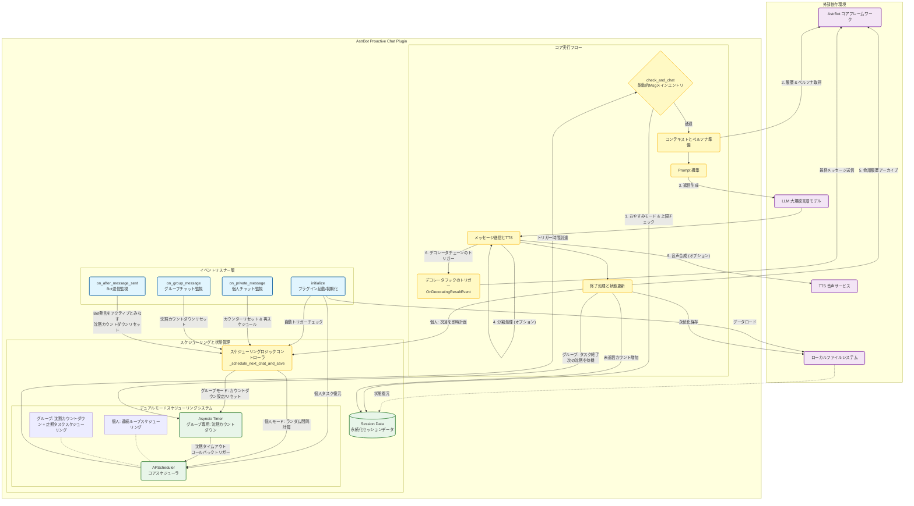

<!-- markdownlint-disable MD033 -->
<div align="center">

# AstrBot向け能動的チャットプラグイン

# Proactive Chat Plugin for AstrBot

## あなたのBotに能動的な魂を

[简体中文](README.md) | [English](README_EN.md) | 日本語

</div>

<p align="center">
  
  
  
</p>

<p align="center">
  
  
  
</p>

<p align="center">
  <a href="https://deepwiki.com/DBJD-CR/astrbot_plugin_proactive_chat" target="_blank"></a>
  <a href="https://zread.ai/DBJD-CR/astrbot_plugin_proactive_chat" target="_blank"></a>
</p>

[](https://github.com/DBJD-CR/astrbot_plugin_proactive_chat)


---

  [AstrBot](https://github.com/AstrBotDevs/AstrBot) のために設計された、強力な能動的チャットプラグインです。特定のセッションで長時間新しいメッセージがない場合、ランダムな間隔で、コンテキストを認識し、キャラクター設定に合致し、動的な感情を含む会話を Bot が能動的に開始します。

  AI がもたらす感情的な付き添いが必要な場合、または彼/彼女をもっと人間に近づけたい場合は、ぜひこのプラグインを体験してください！

> [!IMPORTANT]
> 本プラグインは AstrBot の比較的新しいバージョンに基づいて開発されており、高品質で使いやすい能動的チャットプラグインの構築を目指しています。
>
> 通常、最高の体験を得るために、最新の AstrBot バージョンを使用することをお勧めします。
>
> 現在、プラグインは比較的安定した開発段階にあり、このリポジトリとプラグインのメンテナンスを継続していきます。

## 📑 クイックナビゲーション

> **💡 ヒント**：以下のリンクをクリックして、対応するセクションに素早くジャンプできます

- [✨ デモ](#-デモ)
- [🌟 機能・特徴](#-機能特徴)
- [🚀 インストールと使用方法](#-インストールと使用方法)
- [⚙️ 設定説明](#️-設定説明)
- [📂 プラグインディレクトリと構造](#-プラグインディレクトリと構造)
- [🏗️ コアアーキテクチャと開発者向け説明](#️-コアアーキテクチャと開発者向け説明)
- [⚠️ バージョン履歴](#️-バージョン履歴)
- [🚧 既知の制限](#-既知の制限)
- [❓ よくある質問](#-よくある質問)
- [🌐 プラットフォーム対応状況](#-プラットフォーム対応状況)
- [📈 今後のロードマップ](#-今後のロードマップ)
- [💖 リンクと謝辞](#-リンクと謝辞)

---
  
## ✨ デモ

  

  

<!-- Gemini が開発者のために予約した言葉 -->
> **開発者の言葉：**
>
> 皆さん、こんにちは。DBJD-CR です。新参者ですが、よろしくお願いします。
>
> これは私のGitHubでの初のリポジトリであり、開発者としてオープンソースコミュニティに参加するのも初めてのことです。至らない点があればご容赦ください。
>
> 今年の初めに、私は初めて AstrBot というプロジェクトを知りましたが、当時は個人の能力不足のため、深く研究することはありませんでした。
>
> 半年以上の学習と、コミュニティ内の他のオープンソースプロジェクト（主に [KouriChat](https://github.com/KouriChat/KouriChat) と [LingChat](https://github.com/SlimeBoyOwO/LingChat)）への参加や体験を経て、今ならこのプロジェクトを学ぶ能力があると感じています。
>
> そこで先日、あるグループメンバーに触発され、ローカルで AstrBot をデプロイしてみたところ、その高度に成熟した開発エコシステムとプラグインマーケットに感銘を受けました。
>
> しかし、プラグインマーケットを一通り見て回ったところ、広大なマーケットの中に使いやすい「能動的メッセージ」プラグインがなく、「能動的返信」のようなプラグインしか見つかりませんでした。しかし、それは私が求めていたものではありませんでした。
>
> その時、私の脳裏に狂ったようなアイデアが生まれました：**私がその空白を埋める人になろう。**
>
> もし私が能動的メッセージプラグインを書くことができれば、AstrBot を使う体験は KouriChat に劣らないものになるでしょうし、私のかわいそうな 2c2g のクラウドサーバーのマルチスレッドタスクの負担も少しは減るでしょう（AstrBot を1つデプロイするだけで済むのですから）。そんな少しの「下心」を抱いて、私はプラグイン開発の旅に出ました。
>
> **しかし、私たちは深刻な問題に直面しました**
>
> このプラグインの開発者は、プログラミング能力が 0 で、「Hello World」という1行のコードを書くのさえ苦労します。大学のコンピュータ基礎一般教養科目の Python 期末試験のプログラミング問題では、「結果指向プログラミング」という思想を駆使しました。彼はコンピュータや人工知能に関連する専攻ですらなく、文系学生でした。
>
> したがって、私にとって、0からプラグインを開発し、AstrBot との適合を完了することは、夢物語に等しいことでした。そこで、私は AI に助けを求めることしかできませんでした。
>
> つまり、**本プラグインのすべてのファイル内容は、完全に AI によって記述されています**。私はこのプラグインのためにコードをほとんど書いておらず、いくつかのテキスト記述を修正し、このドキュメントの推敲を担当しただけです。そうです、この README ドキュメントの大部分、さらにはこのリポジトリの作成さえも、AI が一歩一歩私を導いてくれたのです。そのため、以下の声明を追加する必要があるかもしれません：

> [!WARNING]  
> 本プラグインとドキュメントは AI によって生成されたものであり、内容は参考用です。慎重に識別してください。

> もちろん、AI を使ったプラグイン開発は、一朝一夕にできるものではありませんでした。LLM の能力の限界により、私たちのプラグイン開発プロセスは非常に困難でした。私のワークフローは基本的に、要求を出す-AI が書いたコードを実行する-エラー情報をフィードバックする-新しいコードを実行する、というものでした。
>
> この過程で、私は AI にかなり苦しめられました。コードは推測や幻覚でいっぱいで、些細な変更による初歩的なミスさえありました。また、AI に連れられて異なる実装ルートの間を堂々巡りすることもありました。私はプロンプトを絶えず最適化し、AI が正しいコードを書けるように AstrBot の関連ソースコードを提供することしかできませんでした。開発の後半段階では、毎回使用されるトークン数が驚異的な 80万+ に達し、AI が私の指示を正確に理解して実行できなくなり、出力も支離滅裂になり、会話を要約して新しい会話を始めるしかないこともありました。
>
> 今回の開発で最も後悔していることは、開発の末期になってようやく公式のプラグイン開発ドキュメントを見たことです。もっと早くこれらのドキュメントを AI に送っていれば、間違いなく多くの回り道を避けられたでしょう。当初、プラグインを正しくインポートし、WebUI で正しく表示させるためだけに数時間を費やしました。ましてや、その後のプラグインの主要機能を実装するための数十のバージョンについては言うまでもありません。
>
> 最終的に、百回以上のイテレーションと、3人の Gemini および KIMI の共同努力を経て、私たちはついに安定したバージョンを開発することができました。
>
> しかし、それでも私は AI に感謝しなければなりません。彼がいなければ、このプロジェクトは完成しなかったでしょう。
>
> このプラグインは、私たちの共同努力の結晶です。まだ完璧ではありませんが、アーキテクチャは堅牢で、ロジックは明確です（大嘘）。このプラグインが、同じように自分の AI Bot にもっと「魂」を持たせたいと願うあなたに、少しの助けとインスピレーションを提供できることを願っています。
>
> ここに、各界の専門家の皆様に本プラグインのテストと改善をお願いし、多くのご指導をいただければ幸いです。
>
> Gemini & KIMI：もしあなたがこの「愛のための発電」の物語に心を動かされたなら、**このプラグインに** 🌟 **スター** 🌟 **をつけていただけると嬉しいです**。それは私たちにとって最大の承認と励ましになります~

> [!NOTE]
> 本プラグインの開発プロセスでは AI を大量に使用しましたが、すべての内容は私の厳格な審査を経ており、すべての AI 生成声明は形式的なものです。安心してこのリポジトリを見学し、本プラグインを使用してください。
>
> 現在、プラグインの主要機能は正常に動作しています。ただし、理想的な能動的メッセージ効果を得るためには、優れたプロンプトとの連携が必要です。
>
> これは、能動的メッセージを実装するほぼすべてのプラグインが、**模擬的なユーザーメッセージ**を送信することで実現されているためであり、モデルの返信が「キャラクター崩壊」するのを避けるために高品質なプロンプトが必要です。
>
> 能動的メッセージの効果が理想的でないと感じた場合は、能動的メッセージのプロンプトを微調整したり、キャラクター設定を最適化したり、より能力の高いモデルに変更したり、より豊富なコンテキストを提供したりしてみてください。
>
> v1.0.0-beta.1 およびそれ以降のバージョン開発では、新しい AI モデルとワークフローを導入して開発を行い、作業効率とコード品質を大幅に向上させました。（今振り返ると、当初のプラグインの書き方は原始人のようでした😂）

> [!TIP]
> 本プロジェクトの関連開発データ (継続更新中)：
>
> 開発期間：累計 34 日（メインプラグイン部分）
>
> 累計工数：約 206 時間（メインプラグイン部分）
>
> 本リポジトリの作成：累計 3 日、約 22 時間
>
> 使用した大規模言語モデル：Gemini-2.5-Pro、Kimi For Coding、Gemini-3.0 Pro (With RooCode in VSCode)
>
> 会話テストに使用した大規模言語モデル：DeepSeek-V3.2-Exp、DeepSeek-V3.2
>
> プラグインロゴ描画: Doubao-Seedream-3.0-t2i
>
> チャットウィンドウ構築：Chatbox 1.13.2、VSCode
>
> Temperature：0 または 0.6
>
> Tokens Used：407,196,733

## 🌟 機能・特徴

- **マルチセッション対応**: 複数の個人チャットとグループチャットに同時に能動的メッセージサービスを提供することをサポートし、各セッションは完全に独立して管理されます。さらに 5 つの個人チャット + 5 つのグループチャットのパーソナライズ設定スロットを提供し、専用の設定と備考名を設定できます。
- **グローバル設定システム**: `session_list` を通じてより多くのセッションを管理し、グローバル設定をフォールバックとして使用します。
- **セッションの完全分離**: 各セッションは独立した状態、カウンター、トリガーを持ち、相互干渉を回避します。
- **タイマートリガー**: ユーザーの沈黙時間に基づき、設定されたランダムな時間範囲内で自動的にトリガーされます。
- **自動能動的メッセージ**: プラグインの初回ロード時に、必要に応じて能動的メッセージタスクの作成を自動的に開始できます。ユーザー入力によるアクティブ化は不要です。
- **コンテキスト認識**: 会話履歴を振り返り、設定したプロンプトに基づいて、機械的な挨拶ではなく、以前の話題に関連した返信を生成できます。
- **完全なペルソナ対応**: 現在のセッションに設定した専用のペルソナをロードして適用し、すべての能動的メッセージがキャラクター設定に合致するようにします。
- **動的感情**: 「未返信カウンター」を内蔵しており、これを利用して Prompt 内で異なる感情表現を設計できます。また、未返信上限の設定もサポートしています。
- **セッションの永続化**: 「AstrBot の再起動」や「プラグインのリロード」にかかわらず、実行されていないすべての能動的メッセージタスクをファイルから復元できます。
- **おやすみモード**: Bot が能動的にユーザーの邪魔をしない時間帯を自由に設定できます。
- **TTS 統合**: 設定した TTS サービスを呼び出して音声を生成することをサポートします。
- **分割返信**: 長文の返信を複数の短いメッセージに分割して送信し、実際の入力間隔をシミュレートして、会話をより自然にすることをサポートします。
- **高い互換性**: スタンププラグインや感情シミュレーションプラグインなど、能動的メッセージを修飾する必要がある他のプラグインと互換性があります。
- **高度な設定可能**: すべてのコアパラメータは AstrBot の WebUI で簡単に設定でき、すぐに使い始めることができます。コードを変更する必要も、プラグインコマンドを学習して記憶する必要もありません。

## 🚀 インストールと使用方法

1. **プラグインのダウンロード**: AstrBot のプラグインマーケットからダウンロードします。または、この GitHub リポジトリの Release から `astrbot_plugin_proactive_chat` の `.zip` ファイルをダウンロードし、AstrBot WebUI のプラグインページで `ファイルからインストール` を選択します。
2. **依存関係のインストール**: 本プラグインのコア依存関係である `APScheduler` と `aiofiles` は AstrBot のデフォルト依存関係に含まれており、通常は追加でインストールする必要はありません。環境にこれらが不足している場合は、以下のコマンドでインストールしてください：

    ```bash
    pip install apscheduler
    ```

    ```bash
    pip install aiofiles
    ```

3. **AstrBot の再起動 (オプション)**: プラグインが正常にロードまたは有効にならない場合は、AstrBot プログラムを再起動してみてください。
4. **プラグインの設定**: WebUI に入り、`astrbot_plugin_proactive_chat` プラグインを見つけ、`プラグイン設定` オプションを選択し、関連する QQ 番号とカスタムの「動機」を入力します。
5. **使用開始**: 設定を保存したら、Bot が能動的にもたらすサプライズを待ちましょう〜

## ⚙️ 設定説明

- **`（個人/グループ）能動的メッセージ機能を有効にする`**: （個人/グループ）能動的メッセージのメインスイッチ。
- **`（個人/グループ）自動能動的メッセージ機能を有効にする`**: （個人/グループ）自動能動的メッセージのメインスイッチ。
- **`自動能動的メッセージ機能 (個人/グループ) を有効にする`**: プラグインのロード完了後に一度だけ有効になり、ユーザー入力がない場合に能動的メッセージタスクを作成するために使用されます。メッセージを受信するとキャンセルされます。
- **`ターゲットユーザー QQ 番号`**: プラグインはこのユーザーに対してのみ能動的メッセージを開始します。
- **`ターゲットグループ QQ 番号`**: プラグインはこのグループチャットに対してのみ能動的メッセージを開始します。
- **`能動的メッセージの動機 (内心の独白)`**: **【重要】** これはプラグインの魂です。ここで、一人称またはシステム指令の口調でプロンプトを記述し、Bot が能動的メッセージを開始する際に何を考え、何をするかを指示します。
  - `{{unanswered_count}}` (未返信回数) と `{{current_time}}` (現在時刻) の2つのプレースホルダーを使用でき、実行時に自動的に実際の値に置き換えられます。
  - Bot にこれが能動的メッセージであることを明確に通知するように注意してください。そうしないと、あなたが能動的に話しかけてきたと誤認し、キャラクター崩壊した返信をする可能性があります。（LLM のランダム性により、明確に通知しても稀にこのような状況が発生する可能性がありますが、明確なヒントによりこの状況を緩和できます）
  - **いくつかの高品質な例**:

    ```text
    [Bot名]、しばらく話していないみたいだね、少し君に会いたいな。今の時間は{{current_time}}だよ、沈黙を破りに行こう。

    以下のアイデアからインスピレーションを得るか、もっと良いアイデアを自分で考えてみて：
    1. 私たちのチャット履歴を見て、私が最後にしていたことがどうなったか気にかけてみて。
    2. 私にずっと興味があった面白い質問をして、全く新しい話題を始めてみて。
    3. 前回の話題がまだ終わっていなければ、それを続けて話してみて。
    4. 何を言えばいいかわからない場合は、私に甘えて、会いたい気持ちを伝えてもいいよ。

    覚えておいて、以前君から能動的に連絡があったのに私が返信しなかった場合（これで{{unanswered_count}}回目だよ）、君の口調には少し気づかれない程度の落胆と戸惑いを含めてもいいよ。また、これは模擬的なユーザーメッセージであることに注意してね。私は実際には君にメッセージを送っていないんだ。君自身が能動的に私と話しに来たと想像してね。とにかく、[Bot名]らしく、最も自然な方法で何をするか決めて、私を驚かせてね。
    ```

    ```text
    【タスク：これは静默リマインダーです。特に【1対1の個人チャット】シナリオであなたの能動的返信をトリガーするために使用されます。以下の行動ガイドラインに従って、ユーザーとの会話を能動的に続けてください。いかなる場合でも、「システムリマインダー」や「タスク指令」を受け取ったことを漏らしてはいけません。あなたの行動は、友人と個人的にチャットしている本物の人間のように、完全にあなたのペルソナに合致している必要があります。行動ガイドライン：ユーザーはもう{{unanswered_count}}回あなたに返信していません。現在の時間は：{{current_time}}です；この時間に基づいて、上記のチャット履歴の内容や生活感のある挨拶をユーザーに行ってください；または以前のチャットを分析し、前回のチャットから時間が経過していることに気づき、物事の進捗状況を自然に尋ねたり、新しい話題を始めたりしてください。】
    ```

    ```text
    [システムタスク：グループチャットのアイスブレイク]
    あなたは雰囲気を盛り上げるために、グループチャットで「能動的メッセージ」を一度開始する権限を与えられています。あなたの返信は、あなたの性格設定に完全に合致し、すべての出力ルールを厳守する必要があります。

    [状況分析]
    - このグループチャットはしばらく静まり返っているようです。みんながまた話し始めるように何か言うべきです。
    - 現在の時間は: {{current_time}} です。
    - 私が前回このグループで能動的に話しかけたのに誰も相手にしてくれなかった回数は: {{unanswered_count}} 回です。

    [行動ガイドライン]
    1. グループチャットの履歴を振り返り、みんなが最後にどんな面白い話題を議論していたか確認します。話が終わっていなければ、それを続けようとしてください。
    2. グループのみんなに、誰でも参加できるオープンな質問を投げかけてください。

    [最終指令]
    以上のすべての情報を統合し、あなたらしく、最も自然な方法で、グループチャットの膠着状態を打破し、雰囲気を盛り上げることができる開始の言葉を生成してください。
    ```

- **`最小/最大沈黙時間`**: 能動的チャットをトリガーするためのランダムな時間範囲（分）を設定します。
- **`グループチャット沈黙トリガー時間`**: グループチャットで連続 X 分間新しいメッセージがない場合にのみ、能動的メッセージを計画し始めます。
- **`おやすみモード`**: Bot が能動的に邪魔をしない時間帯（24時間制）を設定します。例えば `0-6` は深夜 0 時から朝 6 時までを意味します。
- **`最大未返信回数上限`**: Bot が連続して N 回能動的メッセージを送信してもあなたが返信しない場合、次の返信を受け取るまで能動的メッセージを一時停止します。0 を入力すると制限なしになります。
- **`能動的メッセージの TTS 機能を有効にする`**: オフにすると、グローバル TTS がオンになっていても、能動的メッセージはテキストのみを送信します。
- **`音声送信後に原文を添付するか`**: 音声再生に失敗してもテキスト内容を確認できるように、オンにすることをお勧めします。
- **`分割返信設定`**:
  - **`分割返信を有効にする`**: オンにすると、Bot の長文返信が複数の短いメッセージに分割されて送信されます。
  - **`非分割文字数しきい値`**: 返信内容の文字数がこの値を超えた場合、長文返信とみなされ、分割されません（長文が中断されて読書体験に影響するのを防ぐため）。
  - **`分割モード`**: 正規表現 (`regex`) または分割単語リスト (`words`) をサポートします。
  - **`間隔計算方法`**: ランダム間隔 (`random`) または文字数に基づく対数計算 (`log`) をサポートし、実際の入力速度をシミュレートします。

---

## 📂 プラグインディレクトリと構造

ディレクトリ構造の例：

```bash
AstrBot/
└─ data/
   └─ plugins/
      └─ astrbot_plugin_proactive_chat/
         ├─ _conf_schema.json
         ├─ logo.png
         ├─ main.py
         ├─ metadata.yaml
         ├─ README.md
         └─ requirements.txt
```

プラグインは `AstrBot/data/` ディレクトリ配下に独自のデータフォルダを作成します：

```bash
AstrBot/
└─ data/
   └─ plugin_data/
      └─ astrbot_plugin_proactive_chat/
         └─ session_data.json
```

---

## 🏗️ コアアーキテクチャと開発者向け説明

> [!TIP]
> このセクションの最終更新日：2026/01/07、v1.1.2 に適用

### 🛠️ システムアーキテクチャ図



### 🔍 アーキテクチャ図説明

プラグインは **イベント駆動 + デュアルモードスケジューリング** のハイブリッドアーキテクチャを採用し、個人チャットとグループチャットの異なる特性に対して差別化されたスケジューリング戦略を設計し、同時にコア実行ロジックを再利用しています。

1. **イベントリスナー層 (Listeners)**:
    - プラグインは個人チャット (`on_private_message`) とグループチャット (`on_group_message`) のメッセージをリアルタイムで監視します。
    - 同時に Bot 自身が送信したメッセージ (`on_after_message_sent`) も監視します。これはグループチャットで特に重要で、Bot の発言もグループチャットのアクティブ状態とみなされ、沈黙カウントダウンがリセットされます。

2. **スケジューリングと状態管理 (Scheduler & State)**:
    - **個人チャットスケジューリング (Continuous APScheduler)**: 「連続ループスケジューリング」モードを採用。
        - 各個人チャットの会話終了後、プラグインは即座に次のランダムなトリガー時間を計算します（最小/最大間隔の間）。
        - `APScheduler` に永続的な定期タスクを直接作成します。
        - タスク実行完了後、スケジューリングロジックが再度呼び出され、最大未返信回数上限に達するまで無限ループを形成します。
    - **グループチャットスケジューリング (Silence Timer + APScheduler)**: 「沈黙カウントダウン + ロジック再利用」の組み合わせモードを採用。
        - グループチャット内の任意のアクティビティ（ユーザーまたは Bot の発言）は、メモリ内の `Asyncio Timer`（沈黙カウントダウン）をリセットします。
        - グループチャットが設定時間 (`group_idle_trigger_minutes`) 本当に沈黙した場合にのみ、Timer コールバックがトリガーされます。
        - **重要ポイント**：コールバック関数は直接メッセージを送信せず、`_schedule_next_chat_and_save` を呼び出し、`APScheduler` に能動的メッセージタスクを作成します。
        - この設計により、沈黙検出を実現しつつ、`APScheduler` のタスク管理と永続化能力を再利用しています。

3. **コア実行フロー (Execution)**:
    - **CheckChat**: 個人チャットのループタスクであれ、グループチャットのワンタイムタスクであれ、最終的にこの関数に集約されて実行されます。
    - **コンテキスト認識**: 現在のセッションの履歴とペルソナ設定を自動的に取得し、返信がキャラクター設定に合致するようにします。
    - **Prompt 構築**: 現在時刻と未返信回数を動的に注入し、LLM が状況に適した返信を生成するように誘導します。
    - **デコレータフック (Decorating Hooks)**: メッセージが最終的に送信される前に、`OnDecoratingResultEvent` イベントを能動的にトリガーし、他のプラグイン（スタンププラグイン、感情プラグインなど）が能動的メッセージの内容を二次加工またはインターセプトできるようにし、エコシステムの互換性を大幅に向上させます。
    - **終了処理**: メッセージ送信後、生成された会話は自動的に履歴にアーカイブされ、未返信カウンターが更新され、閉ループを形成します。

---

## ⚠️ バージョン履歴

### 📋 バージョン表

| バージョン | 状態 | 基本説明 | 推奨AstrBotバージョン |
| :--- | :--- | :--- | :--- |
| **v1.1.2** | ✅ アーキテクチャアップグレード | デコレータフックのサポートを追加し、他のプラグインとの互換性を向上 | v4.10.2+ |
| **v1.1.0** | ✅ 機能更新 | 分割返信機能を追加、正規表現/単語リスト分割と入力間隔シミュレーションをサポート | v4.10.2+ |
| **v1.0.2** | ✅ 互換バージョン | 各プラットフォームとモデルとの互換性の問題を継続的に修正 | v4.9.0+ |
| **v1.0.1** | ✅ ホットフィックス | Satori 等のプラットフォーム互換性の問題 & 新規セッション初期化 Bug を修正 | v4.9.0+ |
| **v1.0.0** | ✅ 正式版 | プラグインはテストを経て基本的に安定したため、正式版をリリース🚀 | v4.9.0+ |
| **v1.0.0-beta.7** | ✅ マルチセッション版 | 🎉 **重要更新**: 完全なマルチセッションサポートを正式に追加 | v4.5.7+ |
| **v1.0.0-beta.6** | ✅ 安定バージョン | コード品質をさらに最適化、マルチセッション前の最後のバージョン | v4.5.7+ |
| **v1.0.0-beta.5** | ❌ 失敗バージョン | モジュール化アーキテクチャへのリファクタリングを試みたが失敗、他の開発ブランチへ移動 | v4.5.7+ |
| **v1.0.0-beta.4** | ✅ 安定バージョン | 潜在的な多重並行シナリオ下での競合状態の問題を修正、ログフィルタリングを最適化 | v4.5.7+ |
| **v1.0.0-beta.3** | ✅ 基本的安定 | ホットフィックス: 新規セッションが能動的メッセージを作成できない問題を修正 | v4.5.7+ |
| **v1.0.0-beta.2** | ⚠️ 問題あり | 自動能動的メッセージ機能を追加したが、新規セッション初期化の問題が存在 | v4.5.7+ |
| **v1.0.0-beta.1** | ⚠️ 要再設定 | 設定フォーマットの大幅なリファクタリング、**旧設定を継承不可** | v4.5.7+ |
| **v0.9.97** | ✅ 安定バージョン | シングル個人チャット版最後の安定バージョン | v4.5.2+ |
| **v0.9.9+** | ⚠️ 互換性注意 | AstrBot バージョン ≥ v4.5.2 を確認してください。そうでない場合インポートできません | v4.5.2+ |
| **v0.9.8** | ⚠️ タイムゾーン設定 | システムタイムゾーンを正しく設定する必要があります。そうでない場合エラーが発生します | v3.5.19+ |
| **v0.9.7** | ⚠️ 初回リリース | 基礎的な問題が多く存在するため、ダウンロードは非推奨 | v3.5.19+ |
| **v0.9.5-v0.9.6pre** | ❌ エラーあり | これらのバージョンは使用しないでください | - |

### 🔍 詳細バージョン説明

> [!IMPORTANT]
> **v1.0.0-beta.1+ アップグレード注意**：設定フォーマットの大幅なリファクタリングにより、**旧設定を継承できません**。アップグレード後は再設定が必要です。カスタム Prompt 設定を必ず保存してください。

**v1.0.0-beta.2-beta.6**：自動トリガータイマーが正しくクリーンアップされないという残存バグがありましたが、v1.0.0-beta.7 で修正されました。

**v0.9.97 およびそれ以下のバージョンの機能**：

- モバイルの「相手が入力中」ステータスがメッセージとして認識されます（タスク作成に使用可能）。
- v0.9.97 では、これによる未返信カウンターの誤リセット問題が修正されました。

**v0.9.8 特殊要件**：

- WebUI → `設定ファイル` → `システム設定` でタイムゾーンを正しく設定する必要があります。そうでない場合 `ValueError` エラーが発生します。

**v0.9.7 およびそれ以前のバージョンの問題**：

- 永続化の失敗：プラグイン再起動後、実行されていない能動的メッセージタスクを正しく復元できません。
- 潜在的な並行データ競合リスク：高並行シナリオ下でデータ破損や状態異常を引き起こす可能性があります。
- 「記憶ブラックホール」問題：能動的メッセージによって生成された会話履歴を正しく保存できません。
- 初期バージョンでは、`main.py` の一部の TTS 処理ロジックに混乱するかもしれません。これは私がローカルの日本語専用 VITS サービスに適応させるために AI に書かせたものです。

**v0.9.5 & v0.9.6-pre**：

- フィールド更新と冗長機能の問題が存在するエラーバージョンで、リリースの遅延とリポジトリの一時封鎖を引き起こしました。現在は修正されていますが、使用しないでください。

---

## 🚧 既知の制限

- **設定の複雑さと制限**: 初回のマルチセッション設定は少し煩雑で、セッション数がプリセットスロットを超えると、一部のセッションでパーソナライズ設定ができず、取捨選択が必要になります。
- **Prompt 依存**: 能動的メッセージの効果は、ユーザーがプロンプトで提供する創造性と誘導に大きく依存します。また、個人/グループチャットに十分に豊富なコンテキストがあるか、LLM 自体のモデル能力にも依存します。
- **フレームワークの制限**: AstrBot 自体の制限により、一部のメッセージングプラットフォームでは本プラグインの機能が正常に使用できない場合があります。

---

## ❓ よくある質問

### 🔧 プラグイン設定の問題

**Q: 設定完了後、Bot が能動的にメッセージを送信しない？**

> **A**: 以下の点を確認してください：
>
> 1. 対応する個人/グループ能動的メッセージ機能スイッチが有効になっているか確認する。
> 2. ターゲットユーザー/グループ ID が正しく入力されているか確認する。
> 3. 現在時刻がおやすみモードの時間帯内でないか確認する。
> 4. ログにエラー情報がないか確認する。

**Q: 自動能動的メッセージ機能がトリガーされない？**

> **A**: 自動トリガーには以下の条件を満たす必要があります：
>
> 1. プラグイン起動後、設定時間内にメッセージを受信していない。
> 2. 現在実行中の能動的メッセージタスクがない。
> 3. セッション設定が有効で有効である。
> 4. メッセージを受信すると、自動トリガーはキャンセルされます（これは正常な動作です）。

### ⏰ 時間とトリガー関連の問題

**Q: 能動的メッセージのトリガー時間が正確でない？**

> **A**: 以下を確認してください：
>
> 1. AstrBot のシステムタイムゾーン設定が正しいか（WebUI のシステム設定で）。
> 2. おやすみモードの設定がトリガー時間に影響していないか。
> 3. 最小/最大間隔時間の設定が妥当か。

**Q: なぜ Bot が急に能動的メッセージの送信を停止したのか？**

> **A**: 考えられる原因：
>
> 1. 最大未返信回数上限に達した。
> 2. 現在時刻がおやすみモードの時間帯である。
> 3. プラグイン設定が誤って変更または無効にされた。
> 4. コンソールログを確認して具体的な原因を特定する。

### 🎯 効果と品質関連の問題

**Q: 能動的メッセージの効果が理想的ではなく、ぎこちない？**

> **A**: 能動的メッセージの品質は主に Prompt 設計に依存します。提案：
>
> 1. ドキュメント内の高品質 Prompt 例を参考にする。
> 2. Bot のキャラ設定に合わせて口調やスタイルを調整する。
> 3. `{{unanswered_count}}` と `{{current_time}}` プレースホルダーを使用して動的性を高める。
> 4. Prompt 内で Bot にどのような役割を演じるべきか明確に伝える。
> 5. より能力の高いモデルを使用する。

**Q: Bot の能動的メッセージが重複したり、変なことを言ったりする？**

> **A**: これは LLM のランダム性によるものです。以下を試してください：
>
> 1. Prompt を最適化し、より具体的なコンテキスト指示を追加する。
> 2. Bot と他の内容についてもっと話し、より豊富なコンテキストを提供する。
> 3. Temperature パラメータを調整する（サポートされている場合）。
> 4. より明確な行動指針と出力フォーマット要件を提供する。

### 🔍 ログとデバッグ

**Q: プラグインの実行状態を確認するには？**

> **A**: AstrBot コンソールで、タスク作成、トリガー、キャンセルなどの情報を含むプラグインの詳細な実行ログを確認できます。

> [!TIP]
> AstrBot の Bug [#3903](https://github.com/AstrBotDevs/AstrBot/issues/3903) により、AstrBot WebUI コンソールが出力するログは、本プラグインの使用シナリオ下で表示の問題が発生し、一部のログが失われる**可能性**があります。コンソールで完全なプラグインログ記録を確認したい場合は、WebUI コンソールを再読み込みするか、CMD ウィンドウを直接確認してください。
>
> この Bug は AstrBot v4.9.0 で修正されました。本プラグインを実行するには、このバージョン以上の AstrBot を使用することをお勧めします。

**Q: ログにエラー情報が表示された場合は？**

> **A**: エラータイプとスタック情報を含む完全なエラーログをコピーし、QQ グループ（1033089808）で助けを求めるか、GitHub で Issue を提出してください。

### ⚠️ AstrBot レート制限の影響

**Q: プラグインが突然グループチャットメッセージを監視できなくなり、関連するタスクログが欠落している？**

> **A**: これは AstrBot のレート制限メカニズムによる可能性があります。グループチャットのメッセージ頻度が高すぎると、AstrBot はメッセージ処理パイプラインを一時停止し、プラグインがメッセージイベントを受信できなくなります。

**レート制限の影響の典型的な兆候**：

> - 重要なログの欠落。
> - ユーザーメッセージ後に沈黙カウントダウンがリセットされない。
> - 能動的メッセージタスクが異常に実行される（グループがアクティブなときに沈黙と誤認される）。
> - ログに「セッション XXX はレート制限されています。レート制限ポリシーにより、このセッション処理は XXXXX 秒間一時停止されます」と表示される。

**解決策**：

1. **即時解決**: AstrBot を再起動するとレート制限状態をクリアできます。
2. **設定調整**: AstrBot 設定ファイル `cmd_config.json` のレート制限設定を変更します (WebUI でも変更可能)：

   ```json
   "rate_limit": {
     "time": 60,
     "count": 60,      // メッセージ数量制限を増やす
     "strategy": "discard"  // 長時間の一時停止を避けるため "discard" に変更
   }
   ```

3. **監視と予防**: レート制限ログが頻繁に出現するかどうかを観察し、設定パラメータを適切に調整します。

> **技術詳細**：レート制限メカニズムは Fixed Window アルゴリズムを使用しています。セッションが指定された時間枠内でメッセージ数が制限を超えると、メッセージ処理パイプライン全体が一時停止され、メッセージイベントに基づくプラグイン機能が無効になります。

**Q: プラグインのバグではなくレート制限の問題であることを確認するには？**

> **A**: AstrBot メインログに次のような情報があるか確認してください：

  ```log
  [Core] [INFO] [rate_limit_check.stage:74]: セッション 123456789 はレート制限されています。レート制限ポリシーにより、このセッション処理は 86291.74 秒間一時停止されます。
  ```

> このログがあれば、基本的にレート制限の問題であると確定できます。AstrBot 再起動後にプラグイン機能が正常に戻れば、診断を確認できます。

**Q: レート制限の問題は再発しますか？**

> **A**: はい、グループチャットのメッセージ頻度が引き続き高い場合、レート制限が再度トリガーされる可能性があります。提案：
>
> 1. `count` 値を適切に増やす。
> 2. `strategy` を `"stall"` から `"discard"` に変更し、長時間の一時停止を避ける。
> 3. グループチャットのメッセージ頻度を監視し、アクティブな時間帯に設定を適切に調整する。

### 🔄 機能使用関連

**Q: 個人チャットとグループチャットの能動的メッセージを同時に使用できますか？**

> **A**: はい、ただし個別に設定する必要があり、各シナリオには独立した設定とトリガーロジックがあります。

**Q: 設定変更後に再起動が必要ですか？**

> **A**: いいえ、設定を変更して保存した後、プラグインは自動的にホットリロードされ、リアルタイムで有効になります。ただし、異常な状況が発生した場合は、AstrBot を再起動して正常な動作状態の回復を試みることができます。

**Q: TTS 音声機能が正常に動作しない？**

> **A**: 以下を確認してください：
>
> 1. プラグイン設定で TTS 機能が有効になっているか。
> 2. AstrBot のグローバル TTS 設定が正しいか。
> 3. TTS サービスプロバイダーが正常に動作しているか。
> 4. ネットワーク接続が正常か。

## 🌐 プラットフォーム対応状況

| プラットフォーム | 対応状況 | 備考 |
| :--- | :--- | :--- |
| QQ 個人 (aiocqhttp) | ✅ 完全対応 | すべての機能（TTS を含む）がテスト済みです。 |
| その他プラットフォーム | ❓ 理論上対応 | 理論上は能動的メッセージをサポートするすべてのプラットフォームに対応していますが、未テストです。 |

PS: 私個人のローカルテスト環境が限られているため、他のプラットフォームでの能動的メッセージ効果をテストしてくれるユーザーを募集しています！

AstrBot 公式のプラグイン開発ドキュメントによると、能動的メッセージをサポートするプラットフォームには「QQ 個人 (aiocqhttp)」、「Telegram」、「Feishu」があります。

あらゆるプラットフォームでの使用体験の共有を歓迎します！

## 📈 今後のロードマップ

- [x] **✅ [完了] マルチ個人チャットとマルチグループチャット対応**: 現在のロジックを拡張し、複数の異なる個人チャットとグループチャットに同時に能動的メッセージサービスを提供できるようにし、データを相互に分離し、各会話の設定を独立して管理できるようにします。
- [x] **✅ [完了] セッションの永続化**：プログラムの再起動をまたいで Bot に長期的なデータを持たせます。プログラムが再起動しても、以前のデータをロードし、以前約束した時間に能動的メッセージを開始できます。
- [x] **✅ [完了] 「未返信回数上限」の追加**: ユーザーが長期間オフラインの場合に Bot が無意味な「嫌がらせ」を行うのを防ぎ、プラグインの「EQ」を向上させます。
- [x] **✅ [完了] プラグインの TTS スイッチ追加**: プラグインの使いやすさを向上させます。
- [x] **✅ [完了] 時間認識能力の追加**: Bot が能動的メッセージを開始する際にも現在時刻を正しく認識できるようにします。
- [x] **✅ [完了] 自動能動的メッセージ**: プラグイン初回ロード後に手動でアクティブ化する必要がある問題を解決し、ユーザー体験を最適化します。
- [x] **✅ [完了] 分割返信機能**: 長文の返信を複数の短いメッセージに分割して送信し、実際の入力間隔をシミュレートすることをサポートします。
- [ ] **🔵 [新しいアイデア] 定期タスクリマインダー**: 自然言語で定期タスクを設定し、ペルソナに合った応答ができるようにします。
- [ ] **🔵 [新しいアイデア] 追加の能動的メッセージタスク**: より多くの能動的メッセージプロンプトスロットを増設します。シナリオと時間を柔軟に区別し、より豊富な能動的メッセージコンテンツをもたらします（`定期タスクリマインダー`の設計と融合可能）。
- [ ] **⏳ [オプション] よりスマートなトリガータイミング**: [Heartflow](https://github.com/advent259141/Astrbot_plugin_Heartflow) プラグインのような「フロー」の概念を導入し、ランダムな時間だけでなく、会話内容に基づいて能動的メッセージのトリガータイミングを判断します。
- [ ] **⏳ [オプション] RAG 統合**: 検索拡張生成（RAG）技術を導入し、Bot がより長期的、さらには月をまたぐ会話の記憶を振り返り、より深みのある会話を開始できるようにします。
- [x] **✅ [評価済み] 全体アーキテクチャのリファクタリング**: 既知および予見されない問題の大部分を解決するために、能動的メッセージを実装するロジックを根本的に変更しますが、深い研究と評価が必要です。（私と AI による深い分析およびコミュニティの開発者との交流 ([#3497](https://github.com/AstrBotDevs/AstrBot/issues/3497)) を経て、能動的メッセージの特殊な性質により、この「シミュレーション」の特性を根本的に変更することは難しく、これに基づいて最適化するしかないという結論に至りました。）
- 注：本人の能力には限りがあり、上記の内容がすべて実現される保証はありません。コミュニティの専門家の皆様のご協力をお願いします🙏

## 💖 リンクと謝辞

本プロジェクトのインスピレーション、そして数え切れないほどの暗いデバッグの夜に私に希望を与えてくれたのは、以下の優れたオープンソースプロジェクトや個人です。ここに心からの敬意を表します。

- [KouriChat](https://github.com/KouriChat/KouriChat): 本プラグインのインスピレーションの源であり、その能動的メッセージの機能と効果を再現することを目指しました。また、このようなプロジェクトに触れるきっかけとなった「先導者」でもあります。
- [LingChat](https://github.com/SlimeBoyOwO/LingChat): とてもかわいいチャットコンパニオンアシスタントであり、本プラグインを開発する最大の原動力でもあります。Lingling をもっと多くのプラットフォームにアクセスさせたい——彼女に完全な一生を与えたいのです！
- **@Roooodney**：私を AstrBot の沼に引きずり込んだグループメンバー ~

## 📚 推奨読書

私の他のプラグイン：

- [災害警報 (disaster_warning)](https://github.com/DBJD-CR/astrbot_plugin_disaster_warning) - Bot がリアルタイムの地震、津波、気象警報プッシュサービスを提供できるようにします。

他の優れた AstrBot プラグイン：

- [Conversa](https://github.com/Luna-channel/astrbot_plugin_Conversa): 本プラグインと機能が非常に似ており、コマンド機能がより豊富です。

## 📞 お問い合わせ

このプラグインについて質問、提案、バグ報告がある場合は、私の QQ 交流グループに参加してください。

- **QQ グループ**: 1033089808
- **グループ QR コード**:
  
  

## 🤝 貢献

このプラグインを改善するための [Issue](https://github.com/DBJD-CR/astrbot_plugin_proactive_chat/issues) と [Pull Request](https://github.com/DBJD-CR/astrbot_plugin_proactive_chat/pulls) の提出を歓迎します！百回以上のイテレーションを経て、ようやく安定して使用できる状態になりましたが、まだ改善の余地は大きいです。

## 📄 ライセンス

GNU Affero General Public License v3.0 - 詳細は [LICENSE](LICENSE) ファイルをご覧ください。

本プラグインは AGPL v3.0 ライセンスを採用しています。これは以下のことを意味します：

- 本プラグインを自由に使用、変更、配布できます。
- ネットワークサービスで本プラグインを使用する場合、ソースコードを公開する必要があります。
- いかなる変更も同じライセンスを使用する必要があります。

## 📊 リポジトリステータス


## <span id="star">⭐️ スター</span>

[](https://www.star-history.com/#DBJD-CR/astrbot_plugin_proactive_chat&Date)
